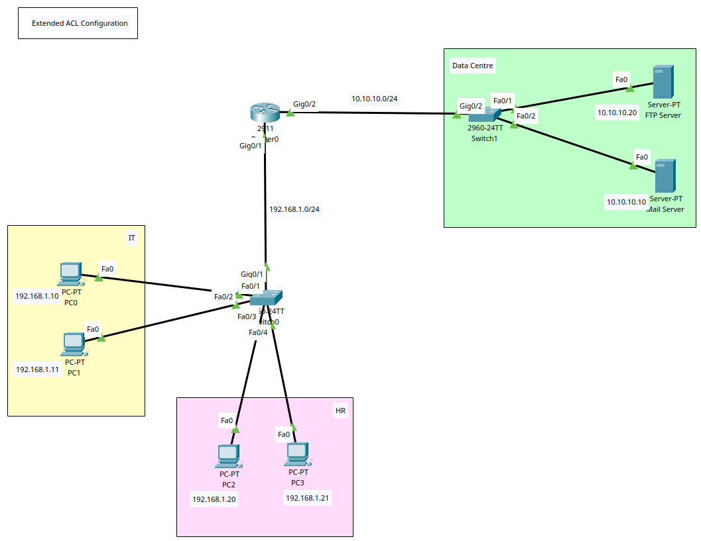

# Routing - Extended ACL Configuration



+ **Access Control Lists (ACL)** are a list of _permit_ or _deny_ rules detailing what traffic can or cannot enter or leave an interface (port, VTY, etc).
+ Every packet is verified against each rule in the ACL until a match is found; if no match is found, it will be denied.
+ AIM: Limit administrative access to switches and routers.
+ ACL rules:
	+ _permit_: allows traffic that matches the criteria.
	+ _deny_: block traffic that matches the criteria and discard the packet.

+ Cisco ACLs primarily come in 2 types - Standard ACLs and Extended ACLs.
	+ _Extended ACL_:
		* Focuses on providing more **granular control** by filtering on source & destination IP addresses, protocol types (TCP/UDP), and destination/source port numbers.
		* Use case: suitable for complex filtering scenarios, like permitting HTTP traffic from one host to another on a specific port.
		* ACL config: `access-list 101 permit ip <source-ip> <source subnet mask> <dest-ip> <dest subnet mask>`
		* Range: > 100
+ Both the Standard and Extended ACLs can be configured as either:
	+ _Numbered_: uses a predefined range of numbers to identify the ACL.
	+ _Named_: uses descriptive names, making them easier to manage, understand, and remember, especially in large networks.


## Scenario
+ 2 Subnets: Data Centre - 10.10.10.0/24 & User PCs - 192.168.1.0/24
+ DHCP Server assigns IPs
+ Extended ACL configured on the router
+ Only IT PCs can access the AD server (10.10.10.20).
+ All PCs can access the Mail server (10.10.10.10)

## Tasks
1. Create VLAN topology in Packet Tracer & Router/Switch/PCs Configuration.
2. Config IP Addresses on the router, Servers, and PCs
3. Try ping servers from IT and HR dept (working)
4. Config Extended ACL to only permit the 2 IT PCs while denying the HR PCs.
5. Bind the ACL to both router interfaces.
6. Try ping servers from IT and HR dept (only IT PCs can access servers)

## Configuration Commands
### Task 1 + 2 - Router, Switch, Server, and PC Basic Config

**Switch 0**
```
! Basic Config
conf t
hostname SW0
ban motd ^Unauthorised Access is Prohibited. All Activity is Logged.^
enable password cisco123
service password-encryption
no ip domain-lookup
ip domain-name cybersec.com

do wr
```

**Switch 1**
```
! Basic Config
conf t
hostname SW0
ban motd ^Unauthorised Access is Prohibited. All Activity is Logged.^
enable password cisco123
service password-encryption
no ip domain-lookup
ip domain-name cybersec.com

do wr
```

**Router 0**
```
! Basic Config
conf t
hostname R0
ban motd ^Unauthorised Access is Prohibited. All Activity is Logged.^
enable password cisco123
service password-encryption
no ip domain-lookup
ip domain-name cybersec.com

!Interface Config
int g0/2
description Link to Data Centre
ip add 10.10.10.1 255.255.255.0
no sh
exit
int g0/1
description Link to Dept Network
ip add 192.168.1.1 255.255.255.0
no sh
exit

do wr
```


## Task 4 + 5 - Router Config ACL

**Router 0**
```
! Create ACL to IT PCs to access both servers
access-list 110 permit ip 192.168.1.10 255.255.255.0 10.10.10.20 255.255.255.0
access-list 110 permit ip 192.168.1.11 255.255.255.0 10.10.10.20 255.255.255.0
access-list 110 permit ip 192.168.1.10 255.255.255.0 10.10.10.10 255.255.255.0
access-list 110 permit ip 192.168.1.11 255.255.255.0 10.10.10.10 255.255.255.0
! Create ACL to HR PCs to access mail server only
access-list 110 permit ip 192.168.1.20 255.255.255.0 10.10.10.10 255.255.255.0
access-list 110 permit ip 192.168.1.21 255.255.255.0 10.10.10.10 255.255.255.0
! Deny any other PCs
access-list 110 deny ip any any
! Bind ACL 110 to Source Interface
int g0/1
ip access-group 110 in
exit

do wr

! View ACL 
do sh access-list
```