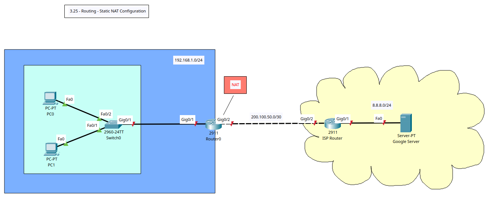

# Routing - Static Network Address Translation Configuration



+ **Network Address Translation (NAT)**: translates internal, private IP addresses into public, globally routable IP addresses, allowing private networks to connect to the internet and conserving public IP address space.
+ A router or firewall will modify the IP packet headers, mapping private addresses to a shared public address or pool of addresses as traffic leaves the internal network and then translating them back when responses return.
+ The router/firewall maintains a translation table, recording the mapping between the original private IP and port and the new public IP and port.
+ **Static NAT**: 
	- Performs a one-to-one mapping between internal private and public IP addresses.
	- Primarily for inbound connections (devices accessible from the internet).
	- Best used for cases where internal devices (servers) need to be reliably accessed from the internet.
	- Requires manual configuration for each device that needs a dedicated public IP.

## Tasks
1. Create VLAN topology in Packet Tracer & Router/Switch/Server/PCs Configuration.
2. Config IP address on routers, PCs, and Server.
3. Config OSPF
4. Ping Google server, traceroute the paths, and check if there are any translations.
5. Config Static NAT on org router for one-to-one translation.
6. Config interfaces as NAT inside and outside.
7. Ping Google server, traceroute the paths, and check if there are any translations.


### Task 1 + 2 - Router, Switch, Server, and PC Basic Config

**Switch 0**
! Basic Config
conf t
hostname SW0
ban motd ^Unauthorised Access is Prohibited. All Activity is Logged.^
enable password cisco123
service password-encryption
no ip domain-lookup
ip domain-name cybersec.com

do wr


**Router 0**
! Basic Config
conf t
hostname R0
ban motd ^Unauthorised Access is Prohibited. All Activity is Logged.^
enable password cisco123
service password-encryption
no ip domain-lookup
ip domain-name cybersec.com

!Interface Config
int g0/2
description Link to ISP Router (Public IP)
ip add 200.100.50.2 255.255.255.252
no sh
exit
int g0/1
description Link to Org Network
ip add 192.168.1.1 255.255.255.0
no sh
exit

do wr

**ISP Router**
! Basic Config
conf t
hostname ISP-R0
ban motd ^Unauthorised Access is Prohibited. All Activity is Logged.^
enable password cisco123
service password-encryption
no ip domain-lookup
ip domain-name public-router.com

!Interface Config
int g0/2
description Link to Org Router
ip add 200.100.50.1 255.255.255.252
no sh
exit
int g0/1
description Link to Google Server
ip add 8.8.8.1 255.255.255.0
no sh
exit

do wr

### Task 3 - Config OSPF
**Router 0**
! Configure Process ID 20
router ospf 20
! Assign each router an ID 
router-id 1.1.1.1
!advertise the direct connected networks
network 192.168.1.0 0.0.0.255 area 0
network 200.100.50.0 0.0.0.3 area 0
exit

do wr

! View OSPF Config
do sh running-config | section router ospf

**ISP Router**
! Configure Process ID 20
router ospf 20
! Assign each router an ID 
router-id 2.2.2.2
!advertise the direct connected networks
network 200.100.50.0 0.0.0.3 area 0
network 8.8.8.0 0.0.0.255 area 0
exit

do wr

! View OSPF Config
do sh running-config | section router ospf


### Task 4 - Ping & Traceroute (No IP Translation)
```
C:\>ping 8.8.8.8

Pinging 8.8.8.8 with 32 bytes of data:

Request timed out.
Reply from 8.8.8.8: bytes=32 time<1ms TTL=126
Reply from 8.8.8.8: bytes=32 time<1ms TTL=126
Reply from 8.8.8.8: bytes=32 time=7ms TTL=126

Ping statistics for 8.8.8.8:
    Packets: Sent = 4, Received = 3, Lost = 1 (25% loss),
Approximate round trip times in milli-seconds:
    Minimum = 0ms, Maximum = 7ms, Average = 2ms

C:\>tracert 8.8.8.8

Tracing route to 8.8.8.8 over a maximum of 30 hops: 

  1   0 ms      0 ms      0 ms      192.168.1.1
  2   0 ms      0 ms      0 ms      200.100.50.1
  3   0 ms      0 ms      0 ms      8.8.8.8

Trace complete.
```


### Task 5 - Config Static NAT on Org Router
**Router 0**
!Confirm NAT Translation Active
do sh ip nat translation

! Config Static NAT (1 to 1)
ip nat inside source static 192.168.1.10 200.100.50.2

do wr

! View NAT convertions
do sh ip nat translation
```
R0(config)#do sh ip nat translation
Pro  Inside global     Inside local       Outside local      Outside global
---  200.100.50.2      192.168.1.10       ---                ---
```


### Task 6 - Config NAT Interfaces
**Router 0**
!Config g0/1 as NAT inside
int g0/1
ip nat inside
exit

! Config g0/2 as NAT outside
int g0/2
ip nat outside
exit

do wr

### Task 7 - Ping & Traceroute (IP Translation Present)
**Router 0**
! View NAT convertions
do sh ip nat translation

```
R0(config)#do sh ip nat translation
Pro  Inside global     Inside local       Outside local      Outside global
icmp 200.100.50.2:26   192.168.1.10:26    8.8.8.8:26         8.8.8.8:26
icmp 200.100.50.2:27   192.168.1.10:27    8.8.8.8:27         8.8.8.8:27
icmp 200.100.50.2:28   192.168.1.10:28    8.8.8.8:28         8.8.8.8:28
icmp 200.100.50.2:29   192.168.1.10:29    8.8.8.8:29         8.8.8.8:29
icmp 200.100.50.2:33   192.168.1.10:33    8.8.8.8:33         8.8.8.8:33
icmp 200.100.50.2:34   192.168.1.10:34    8.8.8.8:34         8.8.8.8:34
icmp 200.100.50.2:35   192.168.1.10:35    8.8.8.8:35         8.8.8.8:35
icmp 200.100.50.2:36   192.168.1.10:36    8.8.8.8:36         8.8.8.8:36
icmp 200.100.50.2:37   192.168.1.10:37    8.8.8.8:37         8.8.8.8:37
icmp 200.100.50.2:38   192.168.1.10:38    8.8.8.8:38         8.8.8.8:38
---  200.100.50.2      192.168.1.10       ---                ---
```