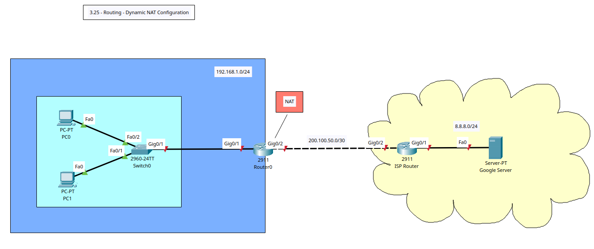

# Routing - Dynamic Network Address Translation Configuration



+ **Network Address Translation (NAT)**: translates internal, private IP addresses into public, globally routable IP addresses, allowing private networks to connect to the internet and conserving public IP address space.
+ A router or firewall will modify the IP packet headers, mapping private addresses to a shared public address or pool of addresses as traffic leaves the internal network and then translating them back when responses return.
+ The router/firewall maintains a translation table, recording the mapping between the original private IP and port and the new public IP and port.

+ **Dynamic NAT**:
	- Assigns public IP addresses from a pool to internal devices dynamically, on a temporary basis; temporary one-to-one mapping from a pool of addresses.
	- Best used when many internal devices need to access the internet, but not simultaenously, allowing orgs to use a smaller number of public IP addresses for a large number of devices/users.
	- It is more efficient with IP addresses, enabling more devices to connect with a limited number of public IPs. 
	- More scalable than Static NAT for large networks; automates the process of assigning public IPs.
	- Primarily used for outbound connections.

## Tasks
1. Create VLAN topology in Packet Tracer & Router/Switch/Server/PCs Configuration.
2. Config IP address on routers, PCs, and Server.
3. Config OSPF
4. Ping Google server, traceroute the paths, and check if there are any translations.
5. Create Standard ACL to permit inside subnet and Config Dymanic NAT for n-n translation.
6. Bind ACL to NAT pool and configure interfaces as NAT inside + outside.
7. Ping Google server, traceroute the paths, and check if there are any translations.

## Configuration Commands

### Task 1 + 2 - Router, Switch, Server, and PC Basic Config

**Switch 0**
```
! Basic Config
conf t
hostname SW0
ban motd ^Unauthorised Access is Prohibited. All Activity is Logged.^
enable password cisco123
service password-encryption
no ip domain-lookup
ip domain-name cybersec.com

do wr
```

**Router 0**
```
! Basic Config
conf t
hostname R0
ban motd ^Unauthorised Access is Prohibited. All Activity is Logged.^
enable password cisco123
service password-encryption
no ip domain-lookup
ip domain-name cybersec.com

!Interface Config
int g0/2
description Link to ISP Router (Public IP)
ip add 200.100.50.2 255.255.255.0
no sh
exit
int g0/1
description Link to Org Network
ip add 192.168.1.1 255.255.255.0
no sh
exit

do wr
```
**ISP Router**
```
! Basic Config
conf t
hostname ISP-R0
ban motd ^Unauthorised Access is Prohibited. All Activity is Logged.^
enable password cisco123
service password-encryption
no ip domain-lookup
ip domain-name public-router.com

!Interface Config
int g0/2
description Link to Org Router
ip add 200.100.50.1 255.255.255.0
no sh
exit
int g0/1
description Link to Google Server
ip add 8.8.8.1 255.255.255.0
no sh
exit

do wr
```
### Task 3 - Config OSPF
**Router 0**
```
! Configure Process ID 20
router ospf 20
! Assign each router an ID 
router-id 1.1.1.1
!advertise the direct connected networks
network 192.168.1.0 0.0.0.255 area 0
network 200.100.50.0 0.0.0.255 area 0
exit

do wr

! View OSPF Config
do sh running-config | section router ospf
```
**ISP Router**
```
! Configure Process ID 20
router ospf 20
! Assign each router an ID 
router-id 2.2.2.2
!advertise the direct connected networks
network 200.100.50.0 0.0.0.255 area 0
network 8.8.8.0 0.0.0.255 area 0
exit

do wr

! View OSPF Config
do sh running-config | section router ospf
```

### Task 4 - Ping & Traceroute (No IP Translation)
```
C:\>ping 8.8.8.8

Pinging 8.8.8.8 with 32 bytes of data:

Request timed out.
Reply from 8.8.8.8: bytes=32 time<1ms TTL=126
Reply from 8.8.8.8: bytes=32 time<1ms TTL=126
Reply from 8.8.8.8: bytes=32 time=7ms TTL=126

Ping statistics for 8.8.8.8:
    Packets: Sent = 4, Received = 3, Lost = 1 (25% loss),
Approximate round trip times in milli-seconds:
    Minimum = 0ms, Maximum = 7ms, Average = 2ms

C:\>tracert 8.8.8.8

Tracing route to 8.8.8.8 over a maximum of 30 hops: 

  1   0 ms      0 ms      0 ms      192.168.1.1
  2   0 ms      0 ms      0 ms      200.100.50.1
  3   0 ms      0 ms      0 ms      8.8.8.8

Trace complete.
```

### Task 5 + 6 - Config Standard ACL & Dynamic NAT on Org Router, Bind NAT with ACL
+ A standard ACL is required because not all internal IPs need to be translated and other devices that do not need internet access (additional security).

**Router 0**
```
! Create Standard ACL internal subnet
access-list 50 permit 192.168.1.0 0.0.0.255

! Create Dynamic NAT IP Pools: name DYNAT, start IP, & last IP
! Use the org's public IP address (range) 
ip nat pool DYNAT 200.100.50.3 200.100.50.10 netmask 255.255.255.0

! Bind NAT with ACL
ip nat inside source list 50 pool DYNAT

! Config NAT inside + outside
!Config g0/1 as NAT inside
int g0/1
ip nat inside
exit

! Config g0/2 as NAT outside
int g0/2
ip nat outside
exit

do wr
```

### Task 7 - Ping & Traceroute (IP Translation Present)
**Router 0**
```
! View NAT conversions
do sh ip nat translation
```
```
R0(config)#do sh ip nat translation
Pro  Inside global     Inside local       Outside local      Outside global
icmp 200.100.50.3:25   192.168.1.10:25    8.8.8.8:25         8.8.8.8:25
icmp 200.100.50.3:26   192.168.1.10:26    8.8.8.8:26         8.8.8.8:26
icmp 200.100.50.3:27   192.168.1.10:27    8.8.8.8:27         8.8.8.8:27
icmp 200.100.50.3:28   192.168.1.10:28    8.8.8.8:28         8.8.8.8:28
```

```
R0(config)#do sh ip nat translation
Pro  Inside global     Inside local       Outside local      Outside global
icmp 200.100.50.3:1    192.168.1.11:1     8.8.8.8:1          8.8.8.8:1
icmp 200.100.50.3:2    192.168.1.11:2     8.8.8.8:2          8.8.8.8:2
icmp 200.100.50.3:3    192.168.1.11:3     8.8.8.8:3          8.8.8.8:3
icmp 200.100.50.3:4    192.168.1.11:4     8.8.8.8:4          8.8.8.8:4
```
