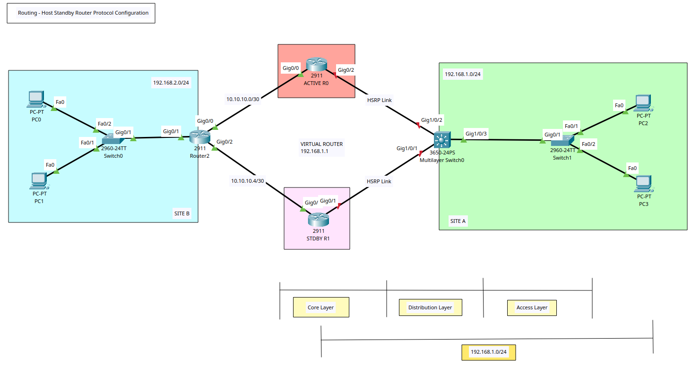

# Routing - Host Standby Router Protocol (HSRP) Configuration

## HSRP Summary
+ A redundancy protocol that creates a fault-tolerant default gateway.
+ It allows a group of routers to work together by presenting a single virtual IP address and virtual MAC address that acts as the default gateway. 
One router in the group is designated the "active" router to forward traffic, while another is the "standby" router ready to take over if the active router fails.
+ **Virtual IP Address**: A shared IP address configured on all routers in the group that hosts use as their default gateway.
+ **Virtual MAC Address**: A shared MAC address that corresponds to the virtual IP address. 
+ **Group number**: A number that identifies a specific HSRP group, used to ensure routers are on the same standby group. 
+ **Priority**: A value from 1 to 255 that determines which router is elected active (higher number wins). The default is 100.
+ **Failover**: 
	- The routers exchange periodic hello messages. If the active router fails, it stops sending hello messages. 
	- The standby router will wait for a configured "holdtime" to expire before taking over the virtual IP and MAC addresses, becoming the new active router. 
+ **Preemption**: A feature called "preempt" allows a router to automatically take back the active role if its priority is higher than the current active router, ensuring the highest-priority router is always active. 
+ **Versions**: HSRPv1 and HSRPv2. Version 2 is not backward-compatible with version 1 and offers a larger range of group numbers. 

## Tasks
1. Create VLAN topology in Packet Tracer & Router/Switch/Server/PCs Configuration.