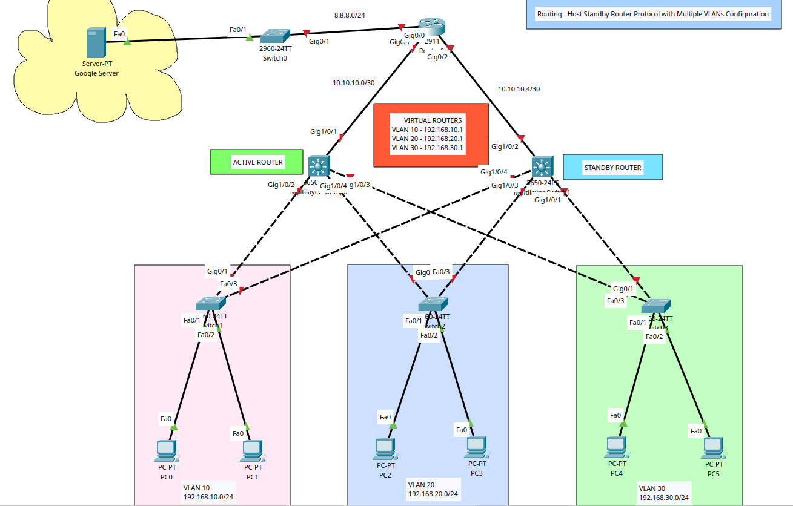

# Routing - Host Standby Router Protocol (HSRP) with Multiple VLANs Configuration



## HSRP Summary

+ A redundancy protocol that creates a fault-tolerant default gateway.
+ It allows a group of routers to work together by presenting a single virtual IP address and virtual MAC address that acts as the default gateway. 
One router in the group is designated the "active" router to forward traffic, while another is the "standby" router ready to take over if the active router fails.
+ **Virtual IP Address**: A shared IP address configured on all routers in the group that hosts use as their default gateway.
+ **Virtual MAC Address**: A shared MAC address that corresponds to the virtual IP address. 
+ **Group number**: A number that identifies a specific HSRP group, used to ensure routers are on the same standby group. 
+ **Priority**: A value from 1 to 255 that determines which router is elected active (higher number wins). The default is 100.
+ **Failover**: 
	- The routers exchange periodic hello messages. If the active router fails, it stops sending hello messages. 
	- The standby router will wait for a configured "holdtime" to expire before taking over the virtual IP and MAC addresses, becoming the new active router. 
+ **Preemption**: A feature called "preempt" allows a router to automatically take back the active role if its priority is higher than the current active router, ensuring the highest-priority router is always active. 
+ **Versions**: HSRPv1 and HSRPv2. Version 2 is not backward-compatible with version 1 and offers a larger range of group numbers.

## Scenario

+ Two sites - Site A, B, and C, need to communicate with each other.
+ All sites require additional redundancy which is achieved by using an additional router (total 2 multilayer switches acting as routers) and configuring HSRP.
+ The inclusion of routers will require configuring atleast one routing protocol - OSPF.


## Tasks

1. Create VLAN topology in Packet Tracer & Router/Switch/PCs/Server Configuration.
2. Config router and multilayer switch IPs
3. Config VLANs on the switches and specify trunk ports.
4. Create the VLANs, enable routing, trunks, and config inter-vlan routing on the multilayer switches and specify the HSRP pramaters on the SVIs.
5. Config OSPF
6. Ping and traceroute to Google Server.
7. Disable any SVI on the active router; ping and traceroute to Google Server.

## Configuration Commands

### Task 1 + 2 - Router, Switch, Server, and PC Basic Config

**Switch 0 (Google Server Switch)**

```
! Basic Config
en
conf t
hostname Google-SW0
ban motd ^Unauthorised Access is Prohibited. All Activity is Logged.^
enable password cisco123
service password-encryption
no ip domain-lookup
ip domain-name cybersec.com

do wr
```

**Switch 1 VLAN 10**
```
! Basic Config
en
conf t
hostname VLAN10-SW1
ban motd ^Unauthorised Access is Prohibited. All Activity is Logged.^
enable password cisco123
service password-encryption
no ip domain-lookup
ip domain-name cybersec.com

do wr
```

**Switch 2 VLAN 20**
```
! Basic Config
en
conf t
hostname VLAN20-SW1
ban motd ^Unauthorised Access is Prohibited. All Activity is Logged.^
enable password cisco123
service password-encryption
no ip domain-lookup
ip domain-name cybersec.com

do wr
```

**Switch 1 VLAN 30**
```
! Basic Config
en
conf t
hostname VLAN30-SW1
ban motd ^Unauthorised Access is Prohibited. All Activity is Logged.^
enable password cisco123
service password-encryption
no ip domain-lookup
ip domain-name cybersec.com

do wr
```

**L3SW0 (ACTIVE)**
+ Interfaces Gig1/0/2-4 will be configured for HSRP
```
! Basic Config
en
conf t
hostname L3SW0
ban motd ^Unauthorised Access is Prohibited. All Activity is Logged.^
enable password cisco123
service password-encryption
no ip domain-lookup
ip domain-name cisco.com

!Config interfaces
int g1/0/1
description link to Router 0
! Make Layer 3 Interface
no switchport
ip add 10.10.10.2 255.255.255.252
no sh
exit

do wr
```

**L3SW1 (STANDBY)**
+ Interfaces Gig1/0/1, Gig1/0/3, Gig1/0/4 will be configured for HSRP
```
! Basic Config
en
conf t
hostname L3SW1
ban motd ^Unauthorised Access is Prohibited. All Activity is Logged.^
enable password cisco123
service password-encryption
no ip domain-lookup
ip domain-name cisco.com

!Config interfaces
int g1/0/2
description link to Router 0
! Make Layer 3 Interface
no switchport
ip add 10.10.10.6 255.255.255.252
no sh
exit

do wr
```

**Router 0**
```
! Basic Config
en
conf t
hostname R0
ban motd ^Unauthorised Access is Prohibited. All Activity is Logged.^
enable password cisco123
service password-encryption
no ip domain-lookup
ip domain-name cybersec.com

!Interface Config
int g0/0
description Link to Google Server
ip add 8.8.8.1 255.255.255.0
no sh
exit
int g0/1
description Link to Active Router
ip add 10.10.10.1 255.255.255.252
no sh
exit
int g0/2
description Link to Standby Router
ip add 10.10.10.5 255.255.255.252
no sh
exit

do wr
```

### Task 3 - Config Switch VLANs and Trunk Ports

**Switch 1 VLAN 10**
```
! COnfigure VLANs
vlan 10 
name IT
exit
vlan 999
name blacklist
exit

!Configure Ports & VLANS
int range f0/1-2
switchport mode access
switchport access vlan 10
exit
int range f0/3-24
switchport mode access
switchport access vlan 999
shutdown
exit

!Configure Trunks
int range g0/1-2
switchport mode trunk
exit

do sh vlan

do sh int trunk

do wr
```

**Switch 2 VLAN 20**
```
vlan 20
name FIN
exit
vlan 999
name blacklist
exit
!Configure Ports on Switch0
int range f0/1-2
switchport mode access
switchport access vlan 20
exit

!Configure Ports & VLANS
int range f0/1-2
switchport mode access
switchport access vlan 20
exit
int range f0/3-24
switchport mode access
switchport access vlan 999
shutdown
exit

!Configure Trunks
int range g0/1-2
switchport mode trunk
exit

do sh vlan

do sh int trunk

do wr
```


**Switch 3 VLAN 30**
```
vlan 30
name HR
exit
vlan 999
name blacklist
exit
!Configure Ports on Switch0
int range f0/1-2
switchport mode access
switchport access vlan 30
exit

!Configure Ports & VLANS
int range f0/1-2
switchport mode access
switchport access vlan 30
exit
int range f0/3-24
switchport mode access
switchport access vlan 999
shutdown
exit

!Configure Trunks
int range g0/1-2
switchport mode trunk
exit

do sh vlan

do sh int trunk

do wr
```

### Task 4 - Multilayer Switch VLANs, Routing, Trunks, Config inter-vlan routing, and HSRP Parameters

**L3SW0 (ACTIVE)**
```
!Config VLANs
vlan 10
name IT
exit
vlan 20
name FIN
exit
vlan 30
name HR
exit

!Enable routing
ip routing

!Config Trunks
int range g1/0/2-3
switchport mode trunk
switchport trunk allowed vlan 10, 20, 30
exit


!Config SVIs for Inter-VLAN Routing (Assign highest IPs)
!VLAN 10
int vlan 10
ip add 192.168.10.3 255.255.255.0
!Specify HSRP params for VLAN 10 SVI
standby 10 priority 100
standby 10 ip 192.168.10.1
exit
!VLAN 20
int vlan 20
ip add 192.168.20.3 255.255.255.0
!Specify HSRP params for VLAN 20 SVI
standby 20 priority 100
standby 20 ip 192.168.20.1
exit
!VLAN 30
int vlan 30
ip add 192.168.30.3 255.255.255.0
!Specify HSRP params for VLAN 30 SVI
standby 30 priority 100
standby 30 ip 192.168.30.1
exit

do sh standby brief

do wr
```

**L3SW1 (STANDBY)**
```
!Config VLANs
vlan 10
name IT
exit
vlan 20
name FIN
exit
vlan 30
name HR
exit
vlan 999
name blacklist
exit

!Enable routing
ip routing

!Config Trunks
int range g1/0/1, g1/0/3-4
switchport mode trunk
switchport trunk allowed vlan 10, 20, 30
exit

!Config SVIs for Inter-VLAN Routing (Assign highest IPs)
! Group numbers (VLANs) must be the same for both multilayer switches/routing
!VLAN 10
int vlan 10
ip add 192.168.10.2 255.255.255.0
!Specify HSRP params for VLAN 10 SVI
standby 10 priority 90
standby 10 ip 192.168.10.1
exit
!VLAN 20
int vlan 20
ip add 192.168.20.2 255.255.255.0
!Specify HSRP params for VLAN 20 SVI
standby 20 priority 90
standby 20 ip 192.168.20.1
exit
!VLAN 30
int vlan 30
ip add 192.168.30.2 255.255.255.0
!Specify HSRP params for VLAN 30 SVI
standby 30 priority 90
standby 30 ip 192.168.30.1
exit

do sh standby brief

do wr
```

### Task 5 - Config OSPF

**Router 0**
```
! Configure Process ID 20
router ospf 20

! Assign router ID 
router-id 1.1.1.1
network 8.8.8.0 0.0.0.255 area 0
network 10.10.10.0 0.0.0.3 area 0
network 10.10.10.4 0.0.0.3 area 0
exit

do wr

! View OSPF Config
do sh running-config | section router ospf

! View OSPF Neighbours
do sh ip ospf neighbor
```


**L3SW0 (ACTIVE)**
```
! Configure Process ID 30
router ospf 30

router-id 2.2.2.2
network 10.10.10.0 0.0.0.3 area 0
network 192.168.10.0 0.0.0.255 area 0
network 192.168.20.0 0.0.0.255 area 0
network 192.168.30.0 0.0.0.255 area 0
exit

do wr

! View OSPF Neighbours
do sh ip ospf neighbor
```

**L3SW1 (STANDBY)**
```
! Configure Process ID 40
router ospf 40

router-id 3.3.3.3
network 10.10.10.4 0.0.0.3 area 0
network 192.168.10.0 0.0.0.255 area 0
network 192.168.20.0 0.0.0.255 area 0
network 192.168.30.0 0.0.0.255 area 0
exit

do wr

! View OSPF Neighbours
do sh ip ospf neighbor
```

### Task 6 - Ping + Traceroute VLANs to Google Server

```
C:\>ping 8.8.8.8

Pinging 8.8.8.8 with 32 bytes of data:

Reply from 8.8.8.8: bytes=32 time<1ms TTL=126
Reply from 8.8.8.8: bytes=32 time<1ms TTL=126
Reply from 8.8.8.8: bytes=32 time<1ms TTL=126
Reply from 8.8.8.8: bytes=32 time<1ms TTL=126

Ping statistics for 8.8.8.8:
    Packets: Sent = 4, Received = 4, Lost = 0 (0% loss),
Approximate round trip times in milli-seconds:
    Minimum = 0ms, Maximum = 0ms, Average = 0ms

C:\>tracert 8.8.8.8

Tracing route to 8.8.8.8 over a maximum of 30 hops: 

  1   0 ms      0 ms      0 ms      192.168.10.3
  2   0 ms      0 ms      0 ms      192.168.10.2
  3   0 ms      0 ms      0 ms      10.10.10.5
  4   0 ms      0 ms      0 ms      8.8.8.8

Trace complete.
```


### Task 7 - Disable any SVI on the active router; ping and traceroute to Google Server
**L3SW0 (ACTIVE)**
```
int vlan 10
shutdown
```

```
C:\>ping 8.8.8.8

Pinging 8.8.8.8 with 32 bytes of data:

Reply from 8.8.8.8: bytes=32 time<1ms TTL=126
Reply from 8.8.8.8: bytes=32 time<1ms TTL=126
Reply from 8.8.8.8: bytes=32 time<1ms TTL=126
Reply from 8.8.8.8: bytes=32 time<1ms TTL=126

Ping statistics for 8.8.8.8:
    Packets: Sent = 4, Received = 4, Lost = 0 (0% loss),
Approximate round trip times in milli-seconds:
    Minimum = 0ms, Maximum = 0ms, Average = 0ms

C:\>tracert 8.8.8.8

Tracing route to 8.8.8.8 over a maximum of 30 hops: 

  1   0 ms      0 ms      0 ms      192.168.10.2
  2   0 ms      0 ms      0 ms      10.10.10.5
  3   0 ms      0 ms      0 ms      8.8.8.8

Trace complete.
s
```