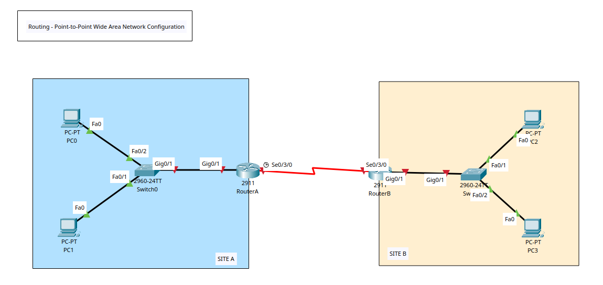
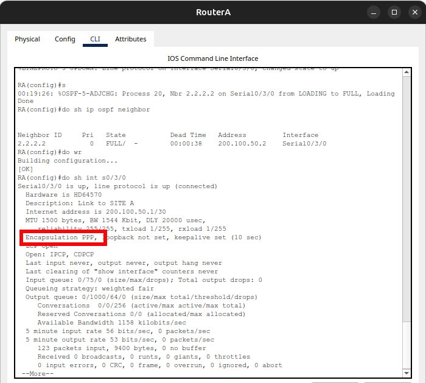

# Routing - Point-to-Point Wide Area Network Configurion



## Point-to-Point Protocol (PPP)

+ PPP is a data link layer (layer 2 frame encapsulation) protocol used to establish a direct connection between two nodes, often over an internet connection.
+ **Features**:
	- Ability to support multiple network protocols (e.g. IP) on a single link.
	- Built-in link testing.
	- Authentication.
	- Link Quality Monitoring: PPP can monitor the quality of the link and take the link down if it falls below a configured threshold. 
	- Loop Detection: PPP uses "magic numbers" to detect and prevent network loops, which can shut down the link if a loop is detected. 
	- Standardization: As a standard protocol, it is not proprietary to any single vendor, making it widely compatible. 

## How it Works

+ **Link Establishment**: PPP uses the Link Control Protocol (LCP) to establish, configure, and test the data link. 
+ **Authentication**: After the link is up, it uses authentication protocols like Password Authentication Protocol (PAP) or Challenge Handshake Authentication Protocol (CHAP) to verify the identity of the connected devices. 
	- _PAP (Password Authentication Protocol)_: A simple but insecure method that sends the username and password in clear text. 
	- _CHAP (Challenge Handshake Authentication Protocol)_: A more secure method where the server sends a challenge to the client, which must encrypt it with a shared secret to prove its identity. 
+ **Network Layer Negotiation**: Once authenticated, the Network Control Protocol (NCP) negotiates the options for the network layer protocols that will be transmitted over the link, such as the Internet Protocol Control Protocol (IPCP) for IP. 
+ **Data Transmission**: 
	- Data is then transmitted in PPP frames. A frame starts and ends with a special flag sequence. 
	- To prevent the flag sequence from appearing in the data, a technique called byte stuffing is used to insert an escape character before any byte that matches the flag or escape character.
+ **Connection Termination**: The connection is torn down once the session is complete. 

## Where is it used?

+ **Internet Access**: PPP was widely used for internet access over dial-up connections and is still relevant in some broadband services. 
+ **Router-to-Router links**: It is used to connect routers directly, creating a dedicated link between them. 
+ **Multiprotocol support**: Because it can carry data from multiple network protocols, it is highly flexible.

## Additional Resources

+ [Cisco - Point-to-Point Protocol](https://www.cisco.com/c/en/us/tech/wan/point-to-point-protocol-ppp/index.html)
+ [Cisco - Configure and Understand the PPP CHAP Authentication](https://www.cisco.com/c/en/us/support/docs/wan/point-to-point-protocol-ppp/25647-understanding-ppp-chap.html)


## Tasks

1. Create VLAN topology in Packet Tracer & Router/Switch/PCs Configuration.
2. Config Router IP Address
3. Config OSPF & Ping
4. Config PPP (routers must be configured with hostname, username, and password)

## Configuration Commands

### Task 1 + 2 - Router, Switch, and PC Basic Config

**Routers A & B**

+ By default 2911 Routers do not include serial ports and thus it is not possible to inter-connect them via serial cable.
+ For each router, access the 'Physical (tab)' > Power off > Add the HWIC-2T module > Power Up the Router. 

**Switch 0**
```
! Basic Config
en
conf t
hostname SW0
ban motd ^Unauthorised Access is Prohibited. All Activity is Logged.^
enable password cisco123
service password-encryption
no ip domain-lookup
ip domain-name cybersec.com

do wr
```

**Switch 1**
```
! Basic Config
en
conf t
hostname SW1
ban motd ^Unauthorised Access is Prohibited. All Activity is Logged.^
enable password cisco123
service password-encryption
no ip domain-lookup
ip domain-name cybersec.com

do wr
```

**Router A**
```
! Basic Config
en
conf t
hostname RA
ban motd ^Unauthorised Access is Prohibited. All Activity is Logged.^
enable password cisco123
service password-encryption
no ip domain-lookup
ip domain-name cybersec.com

!Interface Config
int s0/3/0
description Link to SITE A
ip add 200.100.50.1 255.255.255.252
no sh
exit
int g0/1
description Link to LAN
ip add 192.168.1.1 255.255.255.0
no sh
exit

do wr
```

**Router B**
```
! Basic Config
en
conf t
hostname RB
ban motd ^Unauthorised Access is Prohibited. All Activity is Logged.^
enable password cisco123
service password-encryption
no ip domain-lookup
ip domain-name cybersec.com

!Interface Config
int s0/3/0
description Link to SITE A
ip add 200.100.50.2 255.255.255.252
no sh
exit
int g0/1
description Link to LAN
ip add 192.168.2.1 255.255.255.0
no sh
exit

do wr
```


### Task 3 - Config OSPF & Ping

**Router A**
```
! Configure Process ID 20
router ospf 20

! Assign router ID 
router-id 1.1.1.1
!advertise the direct connected networks
network 192.168.1.0 0.0.0.255 area 0
network 200.100.50.0 0.0.0.3 area 0
exit

do wr

! View OSPF Neighbours
do sh ip ospf neighbor
```

**Router B**
```
! Configure Process ID 30
router ospf 30

! Assign router ID 
router-id 2.2.2.2
!advertise the direct connected networks
network 192.168.2.0 0.0.0.255 area 0
network 200.100.50.0 0.0.0.3 area 0
exit

do wr

! View OSPF Neighbours
do sh ip ospf neighbor
```
```
C:\>ping 192.168.2.10

Pinging 192.168.2.10 with 32 bytes of data:

Reply from 192.168.2.10: bytes=32 time=30ms TTL=126
Reply from 192.168.2.10: bytes=32 time=8ms TTL=126
Reply from 192.168.2.10: bytes=32 time=1ms TTL=126
Reply from 192.168.2.10: bytes=32 time=1ms TTL=126

Ping statistics for 192.168.2.10:
    Packets: Sent = 4, Received = 4, Lost = 0 (0% loss),
Approximate round trip times in milli-seconds:
    Minimum = 1ms, Maximum = 30ms, Average = 10ms

C:\>tracert 192.168.2.10

Tracing route to 192.168.2.10 over a maximum of 30 hops: 

  1   0 ms      0 ms      0 ms      192.168.1.1
  2   6 ms      0 ms      0 ms      200.100.50.2
  3   0 ms      6 ms      6 ms      192.168.2.10

Trace complete.
```

### Task 4 - Config PPP (routers must be configured with hostname, username, and password)
**Router A**
```
! Hostname already configured - RA

! Config Username & Password (Use Hostname of Opposite Router)
username RB password cisco123

! PPP Configuration
int s0/3/0
encapsulation ppp 

ppp authentication chap
exit

do wr
```

**Router B**
```
! Hostname already configured - RA

! Config Username & Password (Use Hostname of Opposite Router)
username RA password cisco123

! PPP Configuration
int s0/3/0
encapsulation ppp 

ppp authentication chap
exit

do wr

! View PPP Configuration
do sh int s0/3/0
```

