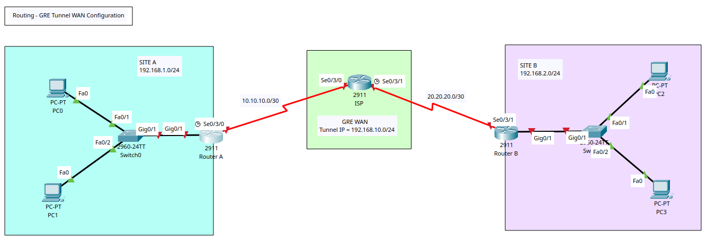
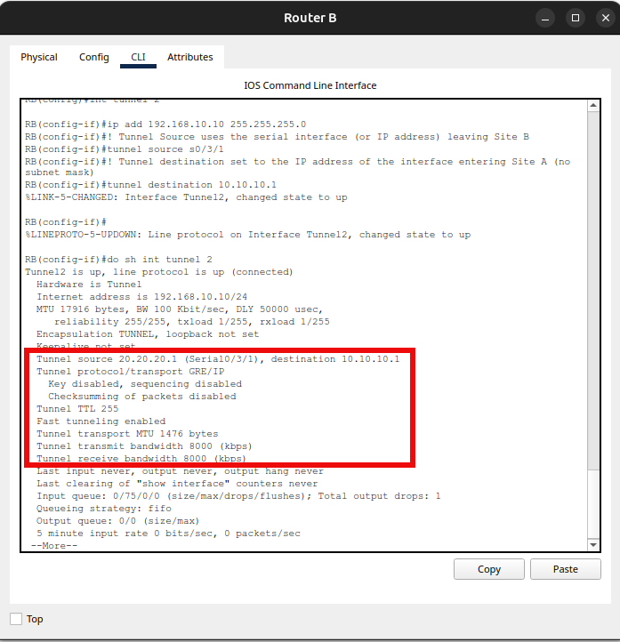

# Routing - Generic Routing Encapsulation (GRE) Tunnel WAN Configuration



## Generic Routing Encapsulation (GRE)

+ It is a protocol that forwards packets from one network to another by encapsulating them inside a new packet.
+ It creates a logical point-to-point link over an IP network, similar to a VPN but without encryption by default. 
+ GRE is used for sending a wide variety of network layer protocols across an IP internetwork and is commonly used for point-to-point connections to cloud services or partner networks. 

## How it Works

+ **Encapsulation**: 
	- A GRE-capable router takes a payload packet (the "inner" packet) and encapsulates it inside a new GRE packet. 
	- This GRE packet is then further encapsulated in a transport protocol, typically an outer IP packet. 
+ **Tunneling**: 
	- The outer IP packet is sent over the public network to the tunnel destination, which decapsulates the packets. 
	- The tunnel destination then forwards the original inner packet to its final destination. 
+ **Keepalives**: 
	- Tunnel endpoints often use keepalive packets to check if the tunnel is still active. 
	- If the keepalive packets stop, the tunnel is considered down. 

## Key Features

+ **Protocol independence**: It can carry a wide variety of network layer protocols inside the tunnel. 
+ **Point-to-point links**: It is ideal for connecting two specific points, such as a corporate network to a cloud service or a partner network. 
+ **No encryption**: By itself, GRE does not provide encryption, making it different from a secure VPN. 
+ **Simplicity**: It is a relatively simple tunneling protocol to set up for point-to-point connectivity.


## Limitations

+ **No encryption by default**: To secure the data, GRE tunnels are often combined with other security protocols like IPsec. 
+ **Scalability**: While useful for point-to-point connections, it is not well-suited for building large networks with many GRE tunnels. 
+ **Configuration**: Correct configuration of tunnel interfaces, IP addresses, and MTU settings is crucial, and mismatched configurations can cause issues. 
+ **Security**: Since GRE doesn't encrypt traffic, it's susceptible to attacks if the tunnel endpoints are not secured. 


## Tasks

1. Create VLAN topology in Packet Tracer & Router/Switch/PCs Configuration.
2. Config Router IP Address
3. Config OSPF & Ping
4. Config GRE to create tunnel beween Sites A + B.

## Configuration Commands

### Task 1 + 2 - Router, Switch, and PC Basic Config

**Routers ISP, A & B**

+ By default 2911 Routers do not include serial ports and thus it is not possible to inter-connect them via serial cable.
+ For each router, access the 'Physical (tab)' > Power off > Add the HWIC-2T module > Power Up the Router. 

**Switch 0**
```
! Basic Config
en
conf t
hostname SW0
ban motd ^Unauthorised Access is Prohibited. All Activity is Logged.^
enable password cisco123
service password-encryption
no ip domain-lookup
ip domain-name cybersec.com

do wr
```

**Switch 1**
```
! Basic Config
en
conf t
hostname SW1
ban motd ^Unauthorised Access is Prohibited. All Activity is Logged.^
enable password cisco123
service password-encryption
no ip domain-lookup
ip domain-name cybersec.com

do wr
```

**Router A**
```
! Basic Config
en
conf t
hostname RA
ban motd ^Unauthorised Access is Prohibited. All Activity is Logged.^
enable password cisco123
service password-encryption
no ip domain-lookup
ip domain-name cybersec.com

!Interface Config
int s0/3/0
description Link to ISP
ip add 10.10.10.1 255.255.255.252
no sh
exit
int g0/1
description Link to LAN
ip add 192.168.1.1 255.255.255.0
no sh
exit

do wr
```

**Router B**
```
! Basic Config
en
conf t
hostname RB
ban motd ^Unauthorised Access is Prohibited. All Activity is Logged.^
enable password cisco123
service password-encryption
no ip domain-lookup
ip domain-name cybersec.com

!Interface Config
int s0/3/1
description Link to ISP
ip add 20.20.20.1 255.255.255.252
no sh
exit
int g0/1
description Link to LAN
ip add 192.168.2.1 255.255.255.0
no sh
exit

do wr
```

**Router ISP**
```
! Basic Config
en
conf t
hostname R-ISP
ban motd ^Unauthorised Access is Prohibited. All Activity is Logged.^
enable password cisco123
service password-encryption
no ip domain-lookup
ip domain-name cybersec.com

!Interface Config
int s0/3/0
description Link to Site A 
ip add 10.10.10.2 255.255.255.252
no sh
exit

int s0/3/1
description Link to Site B 
ip add 20.20.20.2 255.255.255.252
no sh
exit
```


### Task 3 - Config OSPF & Ping
**Router ISP**
```
! Configure Process ID 10
router ospf 10

! Assign router ID 
router-id 1.1.1.1
!advertise the direct connected networks
network 20.20.20.0 0.0.0.3 area 0
network 10.10.10.0 0.0.0.3 area 0
exit

do wr

! View OSPF Neighbours
do sh ip ospf neighbor
```

**Router A**
```
! Configure Process ID 20
router ospf 20

! Assign router ID 
router-id 2.2.2.2
!advertise the direct connected networks
network 192.168.1.0 0.0.0.255 area 0
network 10.10.10.0 0.0.0.3 area 0
exit

do wr

! View OSPF Neighbours
do sh ip ospf neighbor
```

**Router B**
```
! Configure Process ID 30
router ospf 30

! Assign router ID 
router-id 3.3.3.3
!advertise the direct connected networks
network 192.168.2.0 0.0.0.255 area 0
network 20.20.20.0 0.0.0.3 area 0
exit

do wr

! View OSPF Neighbours
do sh ip ospf neighbor
```
+ Ping and Traceroute Results (Site B to A)
```
C:\>ping 192.168.1.10

Pinging 192.168.1.10 with 32 bytes of data:

Reply from 192.168.1.10: bytes=32 time=2ms TTL=125
Reply from 192.168.1.10: bytes=32 time=24ms TTL=125
Reply from 192.168.1.10: bytes=32 time=33ms TTL=125
Reply from 192.168.1.10: bytes=32 time=28ms TTL=125

Ping statistics for 192.168.1.10:
    Packets: Sent = 4, Received = 4, Lost = 0 (0% loss),
Approximate round trip times in milli-seconds:
    Minimum = 2ms, Maximum = 33ms, Average = 21ms

C:\>tracert 192.168.1.10

Tracing route to 192.168.1.10 over a maximum of 30 hops: 

  1   0 ms      0 ms      0 ms      192.168.2.1
  2   0 ms      0 ms      22 ms     20.20.20.2
  3   1 ms      1 ms      1 ms      10.10.10.1
  4   1 ms      0 ms      1 ms      192.168.1.10

Trace complete.
```


### Task 4 - Config GRE to create secure encrypted tunnel
**Router B**
```
int tunnel 2
ip add 192.168.10.5 255.255.255.0
! Tunnel Source uses the serial interface (or IP address) leaving Site A
tunnel source s0/3/0
! Tunnel destination set to the IP address of the interface entering Site B (no subnet mask)
tunnel destination 20.20.20.1 

do wr

!View Tunnel Config
do sh int tunnel 2
```


**Router B**
```
int tunnel 2
ip add 192.168.10.10 255.255.255.0
! Tunnel Source uses the serial interface (or IP address) leaving Site B
tunnel source s0/3/1
! Tunnel destination set to the IP address of the interface entering Site A (no subnet mask)
tunnel destination 10.10.10.1 

do wr

!View Tunnel Config
do sh int tunnel 2
```

```
RA(config-if)#do sh ip int br
Interface              IP-Address      OK? Method Status                Protocol 
GigabitEthernet0/0     unassigned      YES unset  administratively down down 
GigabitEthernet0/1     192.168.1.1     YES manual up                    up 
GigabitEthernet0/2     unassigned      YES unset  administratively down down 
Serial0/3/0            10.10.10.1      YES manual up                    up 
Serial0/3/1            unassigned      YES unset  administratively down down 
Tunnel2                192.168.10.5    YES manual up                    up 
Vlan1                  unassigned      YES unset  administratively down down
```

