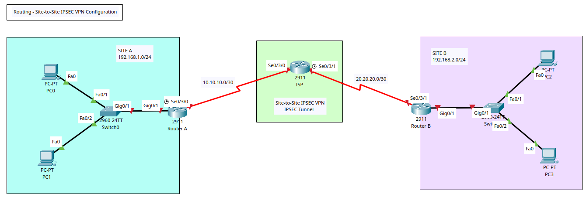

# Routing - Site-to-Site IPSEC VPN Configuration



## Internet Protocol Security (IPSEC)

+ It is a set of network protocols that provide security for data by encrypting and authenticating IP packets, making communication over public networks like the internet private, secure, and reliable.
+ It ensures confidentiality (data cannot be read by unauthorized parties), data integrity (data has not been tampered with), and authentication (the source of the data is verified). 
+ IPsec is often used to establish Virtual Private Networks (VPNs) for secure connections between devices and networks.
+ PSec majorly operates in two ways:
	- _Transport Mode_: Only encrypts the packets payload; the header remains unchanged, enabling routers to determine the destination address of each data packet. It ideally used in a closed and trusted network, e.g. securing a direct link between two PCs.
	- _Tunnel Mode_: All data (including payload and headers) are encrypted and a new header is added; it is appropriate for sending data over public networks because it improves data security against unauthorised parties.
+ To provide security, IPSec uses two main protocols: 
	- _AH (Authentication Header)_: verifies that the data comes from a trusted source and has not been changed.
	- _ESP (Encapsulating Security Payload)_: performs authentication and encrypts data.
+ IPSEC uses cryptographic keys for encryption; created and shared using a process Internet Key Exchange (IKE), ensuring both devices have the correct keys to establish a secure connection.
+ **Internet Key Exchange (IKE)**:
	- It is a network security protocol designed to dynamically exchange encryption keys and find a way over Security Association (SA) between 2 devices.
	- _Security Association (SA)_ establishes shared security attributes between 2 network entities to support secure communication.
	- _Internet Security Association and Key Management Protocol (ISAKMP)_: is a protocol for dynamically establishing security associations and cryptographic keys in an IP environment. It specifies how to setup the SAs and how to direct connections between 2 hosts using IPSEC. 
+ An **IPSec VPN** is a type of VPN software that uses the IPSec protocol to establish encrypted tunnels over the interne; offering end-to-end encryption.

## IPSec Connection Establishment Process

+ The process involves 2 phases:
	- **Phase 1 - Establishing the IKE (Internet Key Exchange) Tunnel**:
		* Main aim is to establish the IKE tunnel, which is used for further negotiations. 
		* It can operate in 2 modes; _Main Mode_ (a six-message exchange procedure that is more secure than Basic Mode at the cost of a longer sessions) and _Aggressive Mode_ (takes less time with the exchange of 3 messages and is less secure).
	- **Phase 2 - Establishing the IPSec Tunnel**: 
		* Called Quick mode, its aim is  to negotiate the IPSec Security Associations after the construction of a secure IKE tunnel has been made.
		* There are 2 main modes - _Tunnel Mode_ and _Transport Mode_.

## Features/Advantages

+ **Authentication**: IPSec provides authentication of IP packets using digital signatures or shared secrets; ensuring that packets are not tampered with or forged.
+ **Confidentiality**: IPSec provides confidentiality by encrypting IP packets, preventing eavesdropping on the network traffic.
+ **Integrity**: IPSec provides integrity by ensuring that IP packets have not been modified or corrupted during transmission.
+ **Key management**: IPSec provides key management services, including key exchange and key revocation, to ensure that cryptographic keys are securely managed.
+ **Tunneling**: IPSec supports tunneling, allowing IP packets to be encapsulated within another protocol, such as GRE (Generic Routing Encapsulation) or L2TP (Layer 2 Tunneling Protocol).
+ **Flexibility**: IPSec can be configured to provide security for a wide range of network topologies, including point-to-point, site-to-site, and remote access connections.
+ **Interoperability**: IPSec is an open standard protocol, which means that it is supported by a wide range of vendors and can be used in heterogeneous environments.

## Disadvantages

+ **Configuration Complexity**: IPSec can be complex to configure and requires specialized knowledge and skills.
+ **Compatibility Issues**: IPSec can have compatibility issues with some network devices and applications, which can lead to interoperability problems.
+ **Performance Impact**: IPSec can impact network performance due to the overhead of encryption and decryption of IP packets.
+ **Key Management**: IPSec requires effective key management to ensure the security of the cryptographic keys used for encryption and authentication.
+ **Limited Protection**: IPSec only provides protection for IP traffic, and other protocols such as ICMP, DNS, and routing protocols may still be vulnerable to attacks.

## Use Cases

+ **Corporate VPNs**: Companies use IPsec to connect remote employees and branch offices to the corporate network securely over the public internet. 
+ **Secure Site-to-Site Connections**:: Establishing secure tunnels between routers of two different networks, such as between two corporate offices. 
+ **Secure Intranet and Extranet Communication**:: Protecting data exchanged between different departments within an organization (intranet) or between trusted partners (extranet). 

## Additional Resources
+ [AWS - What is IPSEC?](https://aws.amazon.com/what-is/ipsec/)
+ [NetworkLessons - Cisco IPsec Tunnel Mode Configuration](https://networklessons.com/cisco/ccie-routing-switching-written/cisco-ipsec-tunnel-mode-configuration)
+ [Cisco - Introduction to Cisco IPsec Technology](https://www.cisco.com/c/en/us/td/docs/net_mgmt/vpn_solutions_center/2-0/ip_security/provisioning/guide/IPsecPG1.html)
+ [Cisco - Configure a LAN-to-LAN IPsec Tunnel Between Two Routers] (https://www.cisco.com/c/en/us/support/docs/routers/1700-series-modular-access-routers/71462-rtr-l2l-ipsec-split.html)

## Tasks
1. Create VLAN topology in Packet Tracer & Router/Switch/PCs Configuration.
2. Config Router IP Address
3. Config OSPF & Confirm Comms between Site A & B
4. Config IPSEC VPN:
	- Enable Security Technology Package
	- Config extended ACL permitting the target on each router
	- Config IKE Phase 1 ISAKMP Policy on each router
	- COnfig IKE Phase 2 IPSec Policy on each router
	- Config crypto map on the ongoing interface


## Configuration Commands

### Task 1 + 2 - Router, Switch, and PC Basic Config

**Routers ISP, A & B**

+ By default 2911 Routers do not include serial ports and thus it is not possible to inter-connect them via serial cable.
+ For each router, access the 'Physical (tab)' > Power off > Add the HWIC-2T module > Power Up the Router. 

**Switch 0**
```
! Basic Config
en
conf t
hostname SW0
ban motd ^Unauthorised Access is Prohibited. All Activity is Logged.^
enable password cisco123
service password-encryption
no ip domain-lookup
ip domain-name cybersec.com

do wr
```

**Switch 1**
```
! Basic Config
en
conf t
hostname SW1
ban motd ^Unauthorised Access is Prohibited. All Activity is Logged.^
enable password cisco123
service password-encryption
no ip domain-lookup
ip domain-name cybersec.com

do wr
```

**Router A**
```
! Basic Config
en
conf t
hostname RA
ban motd ^Unauthorised Access is Prohibited. All Activity is Logged.^
enable password cisco123
service password-encryption
no ip domain-lookup
ip domain-name cybersec.com

!Interface Config
int s0/3/0
description Link to ISP
ip add 10.10.10.1 255.255.255.252
no sh
exit
int g0/1
description Link to LAN
ip add 192.168.1.1 255.255.255.0
no sh
exit

do wr
```

**Router B**
```
! Basic Config
en
conf t
hostname RB
ban motd ^Unauthorised Access is Prohibited. All Activity is Logged.^
enable password cisco123
service password-encryption
no ip domain-lookup
ip domain-name cybersec.com

!Interface Config
int s0/3/1
description Link to ISP
ip add 20.20.20.1 255.255.255.252
no sh
exit
int g0/1
description Link to LAN
ip add 192.168.2.1 255.255.255.0
no sh
exit

do wr
```

**Router ISP**
```
! Basic Config
en
conf t
hostname R-ISP
ban motd ^Unauthorised Access is Prohibited. All Activity is Logged.^
enable password cisco123
service password-encryption
no ip domain-lookup
ip domain-name cybersec.com

!Interface Config
int s0/3/0
description Link to Site A 
ip add 10.10.10.2 255.255.255.252
no sh
exit

int s0/3/1
description Link to Site B 
ip add 20.20.20.2 255.255.255.252
no sh
exit
```
### Task 3 - Config OSPF
**Router ISP**
```
! Configure Process ID 10
router ospf 10

! Assign router ID 
router-id 1.1.1.1
!advertise the direct connected networks
network 20.20.20.0 0.0.0.3 area 0
network 10.10.10.0 0.0.0.3 area 0
exit

do wr

! View OSPF Neighbours
do sh ip ospf neighbor
```

**Router A**
```
! Configure Process ID 20
router ospf 20

! Assign router ID 
router-id 2.2.2.2
!advertise the direct connected networks
network 192.168.1.0 0.0.0.255 area 0
network 10.10.10.0 0.0.0.3 area 0
exit

do wr

! View OSPF Neighbours
do sh ip ospf neighbor
```

**Router B**
```
! Configure Process ID 30
router ospf 30

! Assign router ID 
router-id 3.3.3.3
!advertise the direct connected networks
network 192.168.2.0 0.0.0.255 area 0
network 20.20.20.0 0.0.0.3 area 0
exit

do wr

! View OSPF Neighbours
do sh ip ospf neighbor
```


### Task 4 - Config IPSEC VPN

- Enable Security Technology Package (Required for IPSEC VPN); may require reloading Packet Tracer (& routers) for license/package to take effect. 
- Config extended ACL (used by IPSEC) permitting the target on each router
- Config IKE Phase 1 ISAKMP Policy on each router
- Config IKE Phase 2 IPSec Policy on each router
- Config crypto map on the outgoing interface

**Router A**
```
! Enable Security Technology Package (accept license agreement)
license boot module c2900 technology-package securityk9

!Confirm security package enabled
do sh version

! Config extended ACL (source - destination)
access-list 120 permit ip 192.168.1.0 0.0.0.255 192.168.2.0 0.0.0.255

! Config IKE Phase 1 ISAKMP Policy (No 10)
crypto isakmp policy 10
! Specify encryption for data/packet encryption
encryption aes 256
authentication pre-share
! Specify diffie-hellman for key exchange (IKE) - group 5
group 5
exit

! Specify Pre-Shared Key w/ target ip add of Site B router 
crypto isakmp key cisco987 add 20.20.20.1


! Config IKE Phase 2 IPSec Policy
! Create Transform Set (protocols used to form channel)
crypto ipsec transform-set cybersec-vpn-set esp-aes esp-sha-hmac

! Bind transform set with Phase 1 Policy No
crypto map cybersec-vpn-map 10 ipsec-isakmp

! Set peer with Site B router
description VPN to Site B branch
set peer 20.20.20.1 
set transform-set cybersec-vpn-set

! Specify & Bind ACL Created Earlier
match address 120

exit


! Config Crypto Map on the outgoing interface
int se0/3/0
crypto map cybersec-vpn-map
exit


do wr

! Verify Config
do sh crypto ipsec sa
```
**Router B**
```
! Enable Security Technology Package (accept license agreement)
license boot module c2900 technology-package securityk9

!Confirm security package enabled
do sh version

! Config extended ACL (source - destination w/ wild card mask)
access-list 120 permit ip 192.168.2.0 0.0.0.255 192.168.1.0 0.0.0.255

! Config IKE Phase 1 ISAKMP Policy (No 10)
crypto isakmp policy 10
! Specify encryption for data/packet encryption
encryption aes 256
authentication pre-share
! Specify diffie-hellman for key exchange (IKE) - group 5
group 5
exit

! Specify Pre-Shared Key w/ target ip add of Site B router 
crypto isakmp key cisco987 add 10.10.10.1


! Config IKE Phase 2 IPSec Policy
! Create Transform Set (protocols used to form channel)
crypto ipsec transform-set cybersec-vpn-set esp-aes esp-sha-hmac

! Bind transform set with Phase 1 Policy No
crypto map cybersec-vpn-map 10 ipsec-isakmp

! Set peer with Site B router
description VPN to Site A branch
set peer 10.10.10.1
set transform-set cybersec-vpn-set

! Specify & Bind ACL Created Earlier
match address 120

exit

! Config Crypto Map on the outgoing interface
int se0/3/1
crypto map cybersec-vpn-map
exit


do wr


! Verify Config
do sh crypto ipsec sa
```


```
RA(config)#do sh crypto ipsec sa

interface: Serial0/3/0
    Crypto map tag: cybersec-vpn-map, local addr 10.10.10.1

   protected vrf: (none)
   local  ident (addr/mask/prot/port): (192.168.1.0/255.255.255.0/0/0)
   remote  ident (addr/mask/prot/port): (192.168.2.0/255.255.255.0/0/0)
   current_peer 20.20.20.1 port 500
    PERMIT, flags={origin_is_acl,}
   #pkts encaps: 0, #pkts encrypt: 0, #pkts digest: 0
   #pkts decaps: 0, #pkts decrypt: 0, #pkts verify: 0
   #pkts compressed: 0, #pkts decompressed: 0
   #pkts not compressed: 0, #pkts compr. failed: 0
   #pkts not decompressed: 0, #pkts decompress failed: 0
   #send errors 0, #recv errors 0

     local crypto endpt.: 10.10.10.1, remote crypto endpt.:20.20.20.1
     path mtu 1500, ip mtu 1500, ip mtu idb Serial0/3/0
     current outbound spi: 0x0(0)

     inbound esp sas:

     inbound ah sas:

     inbound pcp sas:

     outbound esp sas:

     outbound ah sas:

     outbound pcp sas:
```

```
RB(config)#do sh crypto ipsec sa

interface: Serial0/3/1
    Crypto map tag: cybersec-vpn-map, local addr 20.20.20.1

   protected vrf: (none)
   local  ident (addr/mask/prot/port): (192.168.2.0/255.255.255.0/0/0)
   remote  ident (addr/mask/prot/port): (192.168.1.0/255.255.255.0/0/0)
   current_peer 10.10.10.1 port 500
    PERMIT, flags={origin_is_acl,}
   #pkts encaps: 0, #pkts encrypt: 0, #pkts digest: 0
   #pkts decaps: 0, #pkts decrypt: 0, #pkts verify: 0
   #pkts compressed: 0, #pkts decompressed: 0
   #pkts not compressed: 0, #pkts compr. failed: 0
   #pkts not decompressed: 0, #pkts decompress failed: 0
   #send errors 0, #recv errors 0

     local crypto endpt.: 20.20.20.1, remote crypto endpt.:10.10.10.1
     path mtu 1500, ip mtu 1500, ip mtu idb Serial0/3/1
     current outbound spi: 0x0(0)

     inbound esp sas:

     inbound ah sas:

     inbound pcp sas:

     outbound esp sas:

     outbound ah sas:

     outbound pcp sas:
```

### Confirm Encrypted Communication

+ Ping from one site to another and issue the command on either router `do sh crypto ipsec sa`.
+ Note, the number of packets has increased & inbound/outbound traffic is recorded.
```
RA(config)#do sh crypto ipsec sa

interface: Serial0/3/0
    Crypto map tag: cybersec-vpn-map, local addr 10.10.10.1

   protected vrf: (none)
   local  ident (addr/mask/prot/port): (192.168.1.0/255.255.255.0/0/0)
   remote  ident (addr/mask/prot/port): (192.168.2.0/255.255.255.0/0/0)
   current_peer 20.20.20.1 port 500
    PERMIT, flags={origin_is_acl,}
   #pkts encaps: 11, #pkts encrypt: 11, #pkts digest: 0
   #pkts decaps: 10, #pkts decrypt: 10, #pkts verify: 0
   #pkts compressed: 0, #pkts decompressed: 0
   #pkts not compressed: 0, #pkts compr. failed: 0
   #pkts not decompressed: 0, #pkts decompress failed: 0
   #send errors 1, #recv errors 0

     local crypto endpt.: 10.10.10.1, remote crypto endpt.:20.20.20.1
     path mtu 1500, ip mtu 1500, ip mtu idb Serial0/3/0
     current outbound spi: 0x493BD126(1228656934)

     inbound esp sas:
      spi: 0xA96FEA66(2842684006)
        transform: esp-aes esp-sha-hmac ,
        in use settings ={Tunnel, }
        conn id: 2004, flow_id: FPGA:1, crypto map: cybersec-vpn-map
        sa timing: remaining key lifetime (k/sec): (4525504/3538)
        IV size: 16 bytes
        replay detection support: N
        Status: ACTIVE

     inbound ah sas:

     inbound pcp sas:

     outbound esp sas:
      spi: 0x493BD126(1228656934)
        transform: esp-aes esp-sha-hmac ,
        in use settings ={Tunnel, }
        conn id: 2005, flow_id: FPGA:1, crypto map: cybersec-vpn-map
        sa timing: remaining key lifetime (k/sec): (4525504/3538)
        IV size: 16 bytes
        replay detection support: N
        Status: ACTIVE

     outbound ah sas:

     outbound pcp sas:
```