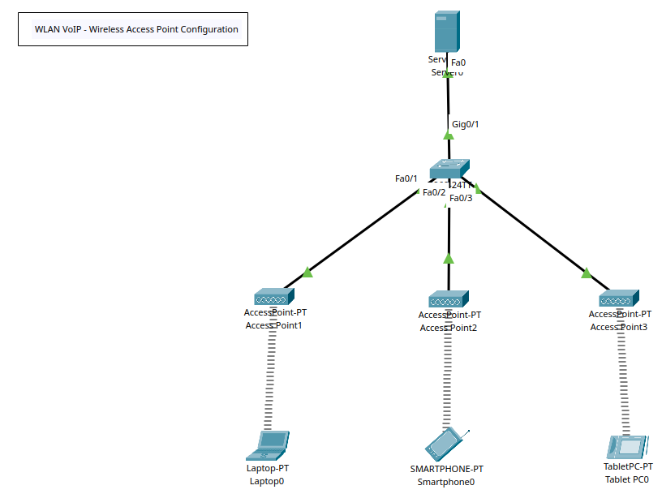

# WLAN VoIP - Wireless Access Point Configuration



## Key Concepts & Terms
### Wireless Fundamentals
+ **Service Set ID (SSID)**: The name of a wireless network broadcast by an access point (AP).
+ **BSSID**: The MAC address of a specific AP. Used to identify the AP within a WLAN.
+ **ESSID**: The name of an extended wireless network consisting of multiple APs.
+ **Basic Service Set (BSS)**: A single AP and its associated clients.
+ **Extended Service Set (ESS)**: Two or more BSSs connected by a distribution system (wired LAN).
+ **Ad-hoc Mode (IBSS)**: Peer-to-peer wireless communication without an AP.
+ **Infrastructure Mode**: Wireless communication via an AP connected to a wired backbone.

## Wireless Security
+ **WEP (Wired Equivalent Privacy)**: Legacy encryption, insecure. Uses RC4.
+ **WPA (Wi-Fi Protected Access)**: Introduced TKIP; still vulnerable.
+ **WPA2**: Uses AES-based CCMP — current minimum standard.
+ **WPA3**: Uses SAE (Simultaneous Authentication of Equals) for better protection.
+ **802.1X / EAP**: Enterprise authentication framework using RADIUS.
+ **PSK (Pre-Shared Key)**: Password-based authentication used in home networks.
+ **RADIUS / TACACS+**: Centralised authentication servers.

+ **Security Best Practices:**:
	- Disable WPS (Wi-Fi Protected Setup)
	- Use strong passphrases and WPA3 if supported
	- Employ network segmentation (guest vs internal WLANs)
	- Monitor with wireless IDS/IPS

## Wireless Standards & Frequencies (IEEE 802.11)
+ **Key Frequency Channels**:
	- _2.4 GHz band_: Channels 1–11 (only 1, 6, and 11 are non-overlapping)
	- _5 GHz band_: Many non-overlapping channels; supports DFS (Dynamic Frequency Selection)
	- _6 GHz band (Wi-Fi 6E)_: More bandwidth, less congestion

|         Standard        | Frequency Band | Max Speed |                            Notes                           |
|:-----------------------:|:--------------:|:---------:|:----------------------------------------------------------:|
| 802.11a                 | 5 GHz          | 54 Mbps   | Shorter range, less interference.                          |
| 802.11b                 | 2.4 GHz        | 11 Mbps   | Older, more interference (microwaves, Bluetooth).          |
| 802.11g                 | 2.4 GHz        | 54 Mbps   | Backward compatible with 802.11b.                          |
| 802.11n                 | 2.4 & 5 GHz    | 600 Mbps  | MIMO introduced.                                           |
| 802.11ac (Wi-Fi 5)      | 5 GHz          | >1 Gbps   | MU-MIMO, wider channels (80/160 MHz).                      |
| 802.11ax (Wi-Fi 6 / 6E) | 2.4, 5, 6 GHz  | ~9.6 Gbps | OFDMA, improved efficiency and performance in dense areas. |

| Standard                    | Frequency Band | Max Speed | Notes                                                      |
| --------------------------- | -------------- | --------- | ---------------------------------------------------------- |
| **802.11a**                 | 5 GHz          | 54 Mbps   | Shorter range, less interference.                          |
| **802.11b**                 | 2.4 GHz        | 11 Mbps   | Older, more interference (microwaves, Bluetooth).          |
| **802.11g**                 | 2.4 GHz        | 54 Mbps   | Backward compatible with 802.11b.                          |
| **802.11n**                 | 2.4 & 5 GHz    | 600 Mbps  | MIMO introduced.                                           |
| **802.11ac (Wi-Fi 5)**      | 5 GHz          | >1 Gbps   | MU-MIMO, wider channels (80/160 MHz).                      |
| **802.11ax (Wi-Fi 6 / 6E)** | 2.4, 5, 6 GHz  | ~9.6 Gbps | OFDMA, improved efficiency and performance in dense areas. |


## Wireless Transmission & Antenna Concepts
+ **ISM Band**: Industrial, Scientific, and Medical frequencies — unlicensed spectrum (e.g., 2.4 GHz, 5 GHz).
+ **MIMO (Multiple Input, Multiple Output)**: Uses multiple antennas for increased throughput and reliability.
+ **MU-MIMO**: Multi-User MIMO — serves multiple clients simultaneously.
+ **Beamforming**: Focuses the wireless signal towards a specific device to improve range and speed.
+ **SNR (Signal-to-Noise Ratio)**: Ratio of signal strength to background noise — higher is better.
+ **RSSI (Received Signal Strength Indicator)**: A measure of the received signal power — used to assess signal quality.
+ **Attenuation**: Signal loss over distance or obstacles.
+ **Interference**: Overlapping frequencies or nearby devices degrading signal quality.
+ **Fresnel Zone**: Elliptical area between transmitter and receiver that must remain clear of obstructions for optimal signal.


## Wireless Network Design & Management
+ **Site Survey**: Assessment of wireless coverage, interference, and placement before deployment. 
+ **Roaming**: Seamless movement between APs in the same ESS. 
+ **Controller-Based Architecture**: APs managed centrally via a wireless LAN controller (WLC). 
+ **Lightweight vs Autonomous APs**: Lightweight APs depend on a controller; autonomous APs operate independently. 
+ **Power over Ethernet (PoE)**: Powers APs through Ethernet cables (IEEE 802.3af/at/bt). 
+ **CAPWAP**: Control and Provisioning of Wireless Access Points protocol used for communication between APs and controllers.
+ **RRM (Radio Resource Management)**: Automatically optimises channel and power settings.

## Wireless Troubleshooting Metrics
+ **Latency**: Delay between sending and receiving data.
+ **Jitter**: Variability in packet delay — affects voice/video.
+ **Packet Loss**: Indicates interference or weak signal.
+ **Throughput**: Actual data rate achieved.
+ **Ping / Traceroute / Wireshark**: Tools for connectivity and analysis. 
+ **Spectrum Analyser / NetSpot / Ekahau / AirMagnet**: Used for signal analysis and site surveys. 

## Common Wireless Attack Vectors
| Attack                      | Description                                                  |
| --------------------------- | ------------------------------------------------------------ |
| **Evil Twin**               | Rogue AP mimicking a legitimate SSID to capture credentials. |
| **Deauthentication Attack** | Forcing clients to disconnect (DoS vector).                  |
| **Packet Sniffing**         | Capturing unencrypted Wi-Fi traffic.                         |
| **KRACK Attack**            | Exploits WPA2 handshake vulnerability.                       |
| **Rogue AP**                | Unauthorised AP connected to network.                        |
| **WPS PIN Attack**          | Exploits WPS vulnerability for easy key recovery.            |


## Tasks
1. Create WLAN topology in Packet Tracer & Configure Wireless Devices.
2. Config APs and DHCP Server.
3. Connect wireless devices to APs.


## Configuration Commands

### Task 1 - Wireless APs (& Network Switch)
**Wireless Configuration**

+ Use the AP-PT for the wireless APs.
+ For each AP perform the following:
	- Config (tab) > Port 1
	- SSID: Change for respective ID
	- Security/Authentication: WPA2-PSK & <passphrase>

+ AP1 Configuration:
	- SSID: IT-DPT
	- Passphrase: passwordit
+ AP2 Configuration: HR-DPT
	- SSID:
	- Passphrase: passwordhr
+ AP3 Configuration:
	- SSID: FIN-DPT
	- Passphrase: passwordfin

**Switch 0**
```
! Basic Config
en
conf t
hostname SW0
ban motd ^Unauthorised Access is Prohibited. All Activity is Logged.^
enable password cisco123
service password-encryption
no ip domain-lookup
ip domain-name cybersec.com

do wr
```

## Task 2 - Config DHCP Server

+ Specify the Server IP configurations (10.10.10.0/24) and DHCP service settings.

## Task 3 - Connect devices to APs

**Laptop Configuration**

+ By default, Packet Tracer laptops do not have a wireless NIC.
+ Add the WiFi NIC:
	- Physical (tab) > Poweroff Laptop
	- Remove Ethernet NIC
	- Drag and insert the WPC300N into the respective slot 
	- Power On laptop
	- Config (tab) > _Wireless0_ should be present.
+ Connect the laptop to the IT AP:
	- Desktop (tab) > PC Wireless
	- Connect (tab) > Refresh to view available networks
	- Select and input respective credentials.

**Smartphone & Tablet**

+ Connect the devices using the following steps:
	- Config (tab) > Wireless0
	- Input the respective WiFi SSID & WPA2-PSK passphrase
