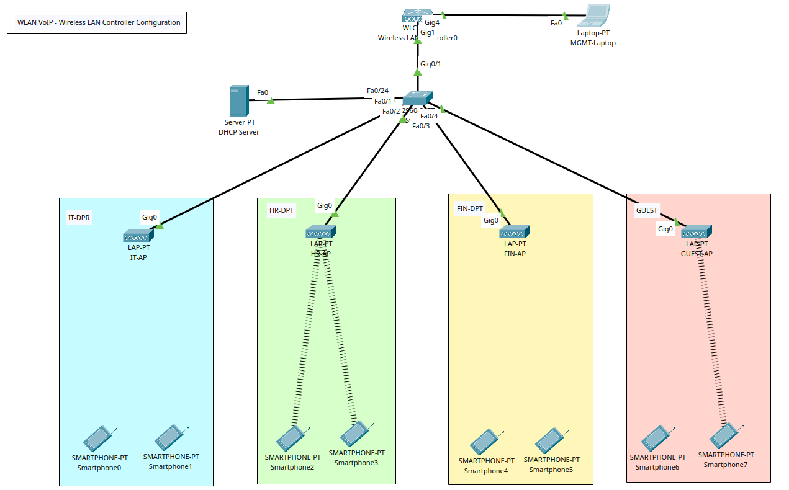
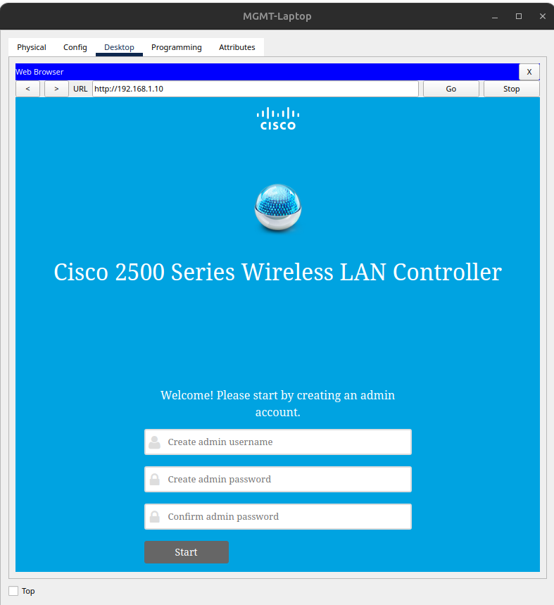
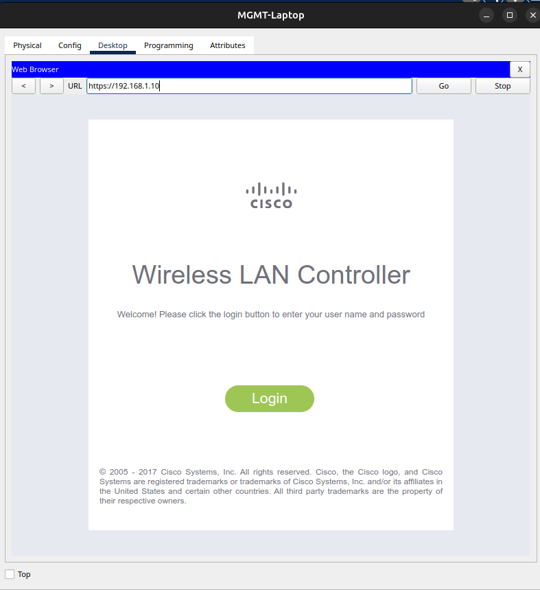
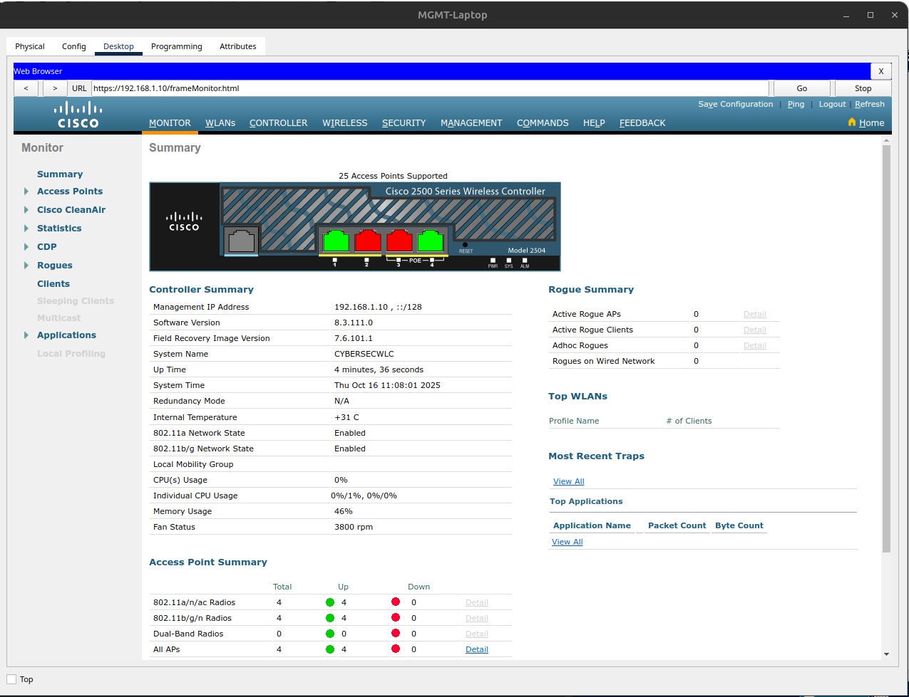

# WLAN VoIP - Wireless LAN Controller Configuration

+ **NOTE**: Packet Tracer is not the most stable when simulating WiFi networks; not all devices will connect to the WLAN.
+ In Packet Tracer, use the WLC-2504 Wireless LAN Controller unit.
+ For the AP, use the Light Weight Access Point (LAP-PT).
+ A **CAPWAP tunnel** is a communication channel established between a wireless access point (AP) and a wireless LAN controller (WLC) for centralized management and data forwarding.

## Tasks
1. Create WLAN topology in Packet Tracer
2. Power On APs and configDHCP Server.
3. Config WLC and APs
4. Connect WiFi devices to their respective APs/SSIDs.

## Configuration Commands

### Task 2 - Power On and config APs, Laptop, and DHCP Server

+ Laptop IP Add: 192.168.1.11
+ DHCP Server: Under the Services (tab), add the IP for the WLC device: 192.168.1.10

**Wireless AP Configuration**

+ APs will need their respective power adaptors connected (Physical - tab).
+ Enable DHCP via the Config (tab)

### Task 3 - Config WLC
**WLC Configuration**

+ Config (tab) > Configure IP addresses
	- IPv4 Address: 192.168.1.10
	- Default Gateway/DNS Server: 192.168.1.1

+ From the management laptop, try to ping the WLC (192.168.1.10).
+ If successful, access the Laptop web browser (http://192.168.1.10)

+ Credentials:
	- Username: cybersec
	- Password: Cisco123
	- System Name: CYBERSECWLC
	- Mgt IP: 192.168.1.10
	- Gateway: 192.168.1.1
+ The next pages allow network admins to create SSID/WLANs.
	- SSID: IT-DPT
	- Passphrase: passwordit
+ RF Parameter optimisation settings can remain with the default settings.

+ Allow the WLC to reboot;.
+ When attempting to access the same web address, a 'Server Connection Reset' error will appear; use this address instead https://192.168.1.10.

+ Login with the credentials set.

+ Tabs:
	- Wireless: Displays the available APs on the network.
	- WLANs: Displays the configured wireless networks and their SSIDs; use this to create additional wireless networks below (make sure each WLAN is enabled).

**AP Configuration**

+ WLANs Configuration:
	- SSID: IT-DPT
	- Passphrase: passwordit
	- SSID: HR-DPT
	- Passphrase: passwordhr
	- SSID: FIN-DPT
	- Passphrase: passwordfin
	- SSID: GUEST
	- Passphrase: password

+ Go to Advanced > AP Groups (left menu):
	- Create additional groups for each AP.
		* IT / IT WiFi Users
		* HR / HR WiFi Users
		* FIN / FIN WiFi Users
		* GUEST / GUEST WiFi Users
	- For each AP Group.
		* WLANs & APs (tabs) > Add its respective WLAN and AP.

### Task 4 - Connect WiFi devices to their respective APs/SSIDs

+ For each WiFi device, connect them to the respective SSID/WLAN.