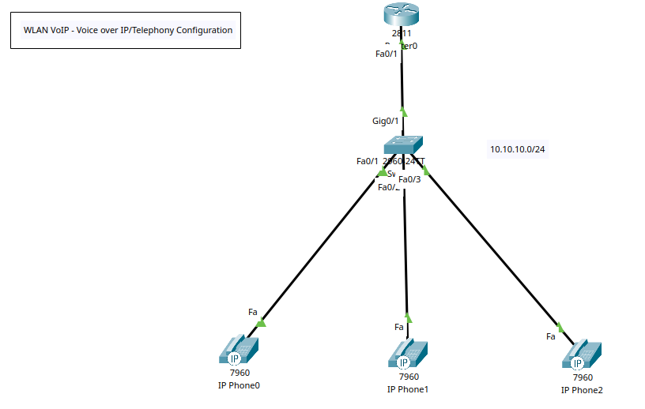
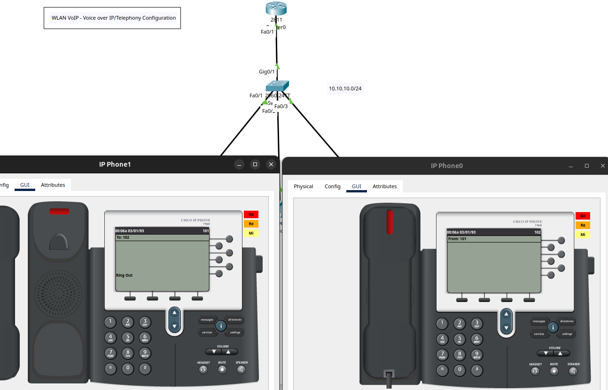

# WLAN VoIP - Voice over IP (VoIP) Device Selection, DHCP, and Phone Configuration



## VoIP Fundamentals

+ **VoIP (Voice over IP)**: Transmission of voice data over IP networks instead of traditional PSTN lines. 
+ **PSTN (Public Switched Telephone Network)**: raditional circuit-switched telephone network. 
+ **IP Telephony**: Broader term encompassing VoIP plus phones, gateways, and PBX integration. 
+ **Softphone**: Software-based phone client (e.g., Zoom, Teams, or Cisco Jabber).
+ **IP Phone (Hardphone)**: Hardware-based VoIP phone connecting via Ethernet. 
+ **Analog Telephone Adapter (ATA)**: Converts analog voice from traditional phones to digital packets for VoIP networks. 
+ **PBX (Private Branch Exchange)**: Internal telephone system managing calls within an organisation. 
+ **IP PBX**: Modern PBX using IP-based signalling and media transport.

## VoIP Architecture Components

+ **Endpoints**: Devices generating or receiving voice (IP phones, softphones).
+ **Gateways**: Connect VoIP networks to PSTN (required to configure VoIP networks). Handle protocol translation and media conversion.
+ **Gatekeeper / Call Manager**: Manages endpoint registration, call routing, bandwidth, and permissions. (e.g., Cisco Unified CM, Asterisk).
+ **SBC (Session Border Controller)**: Security device for VoIP — controls signalling, NAT traversal, and protects against DoS.
+ **Proxy Server**: Handles SIP signalling between endpoints. 
+ **Registrar Server**: Authenticates SIP clients and maintains their location (IP addresses).
+ **Media Server**: Handles media services such as voicemail, conferencing, or IVR.

## VoIP Protocols

| Protocol                                  | Purpose                                                  | Layer       | Notes                                           |
| ----------------------------------------- | -------------------------------------------------------- | ----------- | ----------------------------------------------- |
| **SIP (Session Initiation Protocol)**     | Establishes, modifies, and terminates sessions.          | Application | Most common signalling protocol (RFC 3261).     |
| **H.323**                                 | Older ITU protocol for multimedia communication.         | Application | Used in legacy systems; being replaced by SIP.  |
| **RTP (Real-Time Transport Protocol)**    | Transports audio and video packets.                      | Transport   | Uses UDP; operates alongside RTCP.              |
| **RTCP (Real-Time Control Protocol)**     | Monitors RTP performance (latency, jitter, packet loss). | Transport   | Provides feedback for QoS control.              |
| **MGCP (Media Gateway Control Protocol)** | Controls media gateways from a central call agent.       | Application | Used by Cisco CallManager in early deployments. |
| **SCCP (Skinny Client Control Protocol)** | Cisco proprietary signalling protocol.                   | Application | Lightweight alternative to SIP.                 |
| **SRTP (Secure RTP)**                     | Encrypts and authenticates RTP streams.                  | Transport   | Provides confidentiality and integrity.         |

## VoIP Codecs

| Codec                     | Bitrate    | Notes                                                   |
| ------------------------- | ---------- | ------------------------------------------------------- |
| **G.711 (A-law / µ-law)** | 64 Kbps    | Uncompressed, highest quality, low delay.               |
| **G.729**                 | 8 Kbps     | Compressed, good for WAN links, slightly lower quality. |
| **G.722**                 | 64 Kbps    | Wideband codec for high-definition (HD) voice.          |
| **G.726**                 | 16–40 Kbps | Adaptive differential PCM.                              |
| **Opus**                  | Variable   | Used in modern apps like WebRTC (Skype, Discord).       |

## VoIP Security Concepts

+ **Eavesdropping**: Use SRTP and TLS to encrypt signalling and media.
+ **DoS (Denial of Service)**: SBCs and firewalls protect against floods and malformed packets.
+ **Vishing (Voice Phishing)**: User awareness and call verification policies.
+ **Rogue Devices**: Implement device authentication and VLAN segmentation.
+ **Call Hijacking / Replay Attack**: Use authentication, encryption, and nonce mechanisms.

## Call Setup and Flow (SIP Example)

1. INVITE – Caller sends a SIP INVITE request to start a session.
2. TRYING / RINGING / OK – Recipient’s phone rings and responds with progress messages.
3. ACK – Caller acknowledges successful connection.
4. RTP Stream – Actual voice packets flow between endpoints.
5. BYE – Either side ends the session.

+ Ports to remember:
	* SIP (UDP/TCP) → 5060 (unencrypted)
	* SIP (TLS) → 5061 (encrypted)
	* RTP → Dynamic UDP ports (typically 16384–32767)

## Tasks
1. Create VoIP topology in Packet Tracer.
2. Config switchports to access default voice LAN.
3. Config trunk to the interface connecting to the router.
4. Config route interface IP and create a DHCP pool for voice.
5. Config telephone service.
6. Allocate dial numbers/extensions to IP phones.


## Configuration Commands

### Task 1 - VoIP Topology
+ Use the 2811 Router model and 7960 IP Phone for this simulation.
+ 7960 IP Phones will need their respective power adaptors connected (Physical - tab).

### Task 2, 3, and 4 - Config Switch (Trunk and Voice VLAN) and Router

**Switch 0**
```
! Basic Config
en
conf t
hostname SW0
ban motd ^Unauthorised Access is Prohibited. All Activity is Logged.^
enable password cisco123
service password-encryption
no ip domain-lookup
ip domain-name cybersec.com

! Config Voice VLAN
int range f0/1-3
switchport voice vlan 1
exit

!Config Trunk Port
int g0/1
switchport mode trunk
exit

do wr
```

**Router 0**
```
! Basic Config
en
conf t
hostname R0
ban motd ^Unauthorised Access is Prohibited. All Activity is Logged.^
enable password cisco123
service password-encryption
no ip domain-lookup
ip domain-name cybersec.com

! Config router interface
int f0/1
ip add 10.10.10.1 255.255.255.0
no sh
exit

service dhcp

! Config DHCP Pool
ip dhcp pool VoIP-Pool
network 10.10.10.0 255.255.255.0
default-router 10.10.10.1
option 150 ip 10.10.10.1
exit

do wr

! View DHCP IP Pool Config
do sh ip dhcp pool
```

### Task 5 - Config Telephone Service

**Router 0**
```
! Enable telephone Service
telephony-service

! Specify number of phones in the network
max-ephones 3
! Max No of Phones must match the No of Directories
max-dn 3
!Define Gateway
ip source-address 10.10.10.1 port 2000
auto assign 1 to 3
exit

do wr
```

### Task 6 - Allocate dial numbers/extensions to IP phones

**Router 0**
```
! Create for each phone/directories created
ephone-dn 1
! Specify Line/Dial Number
number 101
exit

ephone-dn 2
number 102
exit

ephone-dn 3
number 103
exit

do wr
```

```
RA(config)#
%IPPHONE-6-REGISTER: ephone-1 IP:10.10.10.2 Socket:2 DeviceType:Phone has registered.

%IPPHONE-6-REGISTER: ephone-2 IP:10.10.10.3 Socket:2 DeviceType:Phone has registered.

%IPPHONE-6-REGISTER: ephone-3 IP:10.10.10.4 Socket:2 DeviceType:Phone has registered.
```

+ Testing calling between IP Phones.

