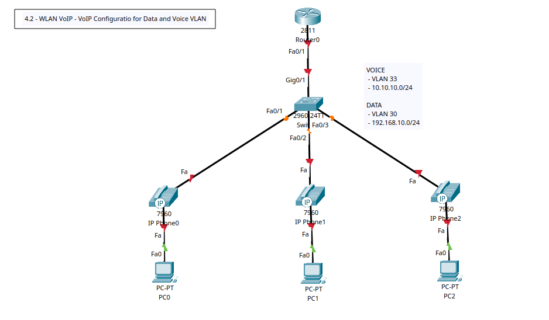
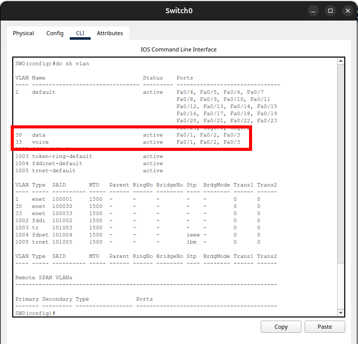

# WLAN VoIP - VoIP Configuration for Data and Voice VLAN

+ Scenario: Connecting PCs/Laptops to the network via an IP Phone.



## Tasks
1. Create VoIP topology in Packet Tracer.
2. Config Switcports for both data and voice vlans.
3. Config trunk between switch and router.
4. Config subinterfaces on router and bind to VLAN IP then assign IP addresses.
5. Create DHCP pools for data and voice.
6. Config telephony service.
7. Allocate dial numbers/extensions to IP phones.


## Configuration Commands

### Task 1 - VoIP Topology
+ Use the 2811 Router model (voice gateway) and 7960 IP Phone for this simulation.
+ 7960 IP Phones will need their respective power adaptors connected (Physical - tab).

### Task 2, 3, and 4 - Config Switch (Trunk and Voice VLAN) and Router

**Switch 0**
```
! Basic Config
en
conf t
hostname SW0
ban motd ^Unauthorised Access is Prohibited. All Activity is Logged.^
enable password cisco123
service password-encryption
no ip domain-lookup
ip domain-name cybersec.com

vlan 33 
name voice
exit
vlan 30
name data
exit

! Config Voice VLAN
int range f0/1-3
switchport mode access 
switchport access vlan 30
switchport voice vlan 33
exit

!Config Trunk Port
int g0/1
switchport mode trunk
exit

do wr
```



**Router 0**
```
! Basic Config
en
conf t
hostname R0
ban motd ^Unauthorised Access is Prohibited. All Activity is Logged.^
enable password cisco123
service password-encryption
no ip domain-lookup
ip domain-name cybersec.com

! Config router subinterface
int f0/1
no sh
exit

! Voice subinterface definition and binding
int f0/1.33
encapsulation dot1Q 33
ip add 10.10.10.1 255.255.255.0
exit

! Data subinterface definition and binding
int f0/1.30
encapsulation dot1Q 30
ip address 192.168.10.1 255.255.255.0
exit


do wr
```

### Task 5 - Create DHCP Pools
**Router 0**
```
!Enable DHCP service
service dhcp

! Config VoIP DHCP Pool
ip dhcp pool VoIP-Pool
network 10.10.10.0 255.255.255.0
default-router 10.10.10.1
option 150 ip 10.10.10.1
exit

! Config Data DHCP Pool
ip dhcp pool DATA-Pool
network 192.168.10.0 255.255.255.0
default-router 192.168.10.1
exit

do wr

! View DHCP IP Pool Config
do sh ip dhcp pool
```

+ Pool already issued 3 IPs to the 3 Phones and 3 PCs.
+ Ensure the PCs are configured for DHCP (default is Static).
```
R0(config)#do sh ip dhcp pool

Pool VoIP-Pool :
 Utilization mark (high/low)    : 100 / 0
 Subnet size (first/next)       : 0 / 0 
 Total addresses                : 254
 Leased addresses               : 3
 Excluded addresses             : 0
 Pending event                  : none

 1 subnet is currently in the pool
 Current index        IP address range                    Leased/Excluded/Total
 10.10.10.1           10.10.10.1       - 10.10.10.254      3    / 0     / 254

Pool DATA-Pool :
 Utilization mark (high/low)    : 100 / 0
 Subnet size (first/next)       : 0 / 0 
 Total addresses                : 254
 Leased addresses               : 3
 Excluded addresses             : 0
 Pending event                  : none

 1 subnet is currently in the pool
 Current index        IP address range                    Leased/Excluded/Total
 192.168.10.1         192.168.10.1     - 192.168.10.254    3    / 0     / 254
```

+ **NOTE**: To exclude IPs from the DHCP Pool, execute the following on the router.

**Router 0**
```
ip dhcp excluded-address 192.168.10.10 - 192.168.10.25
```

### Task 6 - Config telephony service

**Router 0**
```
! Enable telephone Service
telephony-service

! Specify number of phones in the network
max-ephones 10
! Max No of Phones must match the No of Directories
max-dn 10
!Define Gateway
ip source-address 10.10.10.1 port 2000
auto assign 1 to 10
exit

do wr
```


### Task 6 - Allocate dial numbers/extensions to IP phones

**Router 0**
```
! Create for each phone/directories created
ephone-dn 1
! Specify Line/Dial Number
number 101
exit

ephone-dn 2
number 102
exit

ephone-dn 3
number 103
exit

do wr
```