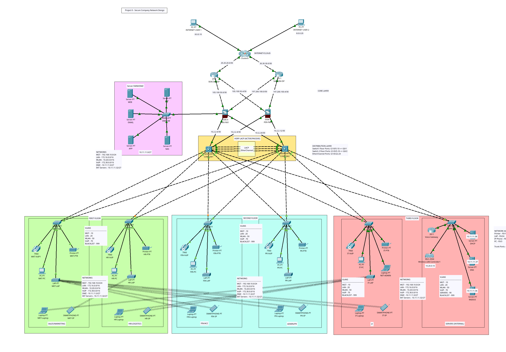

# Project 0 - Secure Company Network Design

## Tasks
1. Create Topology in Packet Tracer.
2. Config basic settings (including SSH and Standard ACL for MGT n/w) for all devices (Routers, Switches, WLC, PCs, Firewalls)
3. L2 and L3 Switch Configuration:
	- VLANs
	- Trunk Ports
	- STP Portfast and BPDUGuard on access ports.
	- Config Port Security on access ports.
	- Config DHCP Snooping on DHCP/AD Server Port.
4. EtherChannel configuration.
5. Subnetting and IP Address Assignment & Static IPs (DMZ/Servers)
6. HSRP and inter-VLAN routing on L3 switches (& IP DHCP helper addresses).
7. DHCP Service configuration.
8. OSPF config on firewall, routers, and L3 switches.
9. Config firewall interface security zones and levels.
10. Config firewall routing-ospf and static routes
11. Config firewall inspection policy.
12. Config wireless network.
13. Config VoIP
14. Verify and test configurations.

## Devices

+ DMZ (2 Physical Servers w/ Hypervisor virtualisation):
	- AD
	- FTP
	- WEB 
	- Email
	- SMTP
+ Inside Zone:
	- DHCP
	- Radius
	- DNS
+ Firewalls:
	- ASA 5500-X (2 Units)
+ Switching:
	- Catalyst 3850 48-Port (2 Units)
	- Catalyst 2960 48-Port
+ Wireless:
	- Wireless LAN Controllers (2 Units)
	- Lightweight Access Points
+ VoIP:
	- IP Phones
	- Voice Gateway

| **L2 Switches** | **L3 Switches** | **Routers**   | **Firewalls** | **Servers**        |
| --------------- | --------------- | ------------- | ------------- | ------------------ |
| DMZ-SW          | CORE-SW1        | SEACOM-ISP    | PER-FW1       | _Internal Servers_ |
| MKT-SW          | CORE-SW2        | SAFCOM-ISP    | PER-FW2       | DHCP               |
| HR-SW           |                 | CLOUD-R0      |               | DNS                |
| FIN-SW          |                 | Voice Gateway |               | RADIUS             |
| PR-SW           |                 |               |               | WLC                |
| IT-SW           |                 |               |               | _DMZ Servers_      |
| SVR-SW          |                 |               |               | FTP                |
|                 |                 |               |               | WEB                |
|                 |                 |               |               | APP                |
|                 |                 |               |               | EMAIL              |
|                 |                 |               |               | NAS                |

## Network Structure

### VLANs
+ Management - 10
+ LAN - 20
+ WLAN - 50
+ VoIP - 70
+ SERVER - 90
+ Blacklist - 999

### Task 5 - IP Address Subnetting and Server Static IPs.

+ Access Layer IP address subnetting.

| **Category** | **Network & Subnet Mask** | **Valid Host Addresses**      | **Default Gateway** | **Broadcast Address** |
| ------------ | ------------------------- | ----------------------------- | ------------------- | --------------------- |
| **MGT**      | 192.168.10.0/24           | 192.168.10.1 – 192.168.10.254 | 192.168.10.1        | 192.168.10.255        |
| **WLAN**     | 10.20.0.0/16              | 10.20.0.1 – 10.20.255.254     | 10.20.0.1           | 10.20.255.255         |
| **LAN** wired| 172.16.0.0/16             | 172.16.0.1 – 172.16.255.254   | 172.16.0.1          | 172.16.0.255          |
| **VoIP**     | 172.30.0.0/26             | 172.30.0.1 – 172.30.255.254   | 172.30.0.1          | 172.30.0.255          |
| **DMZ**      | 10.11.11.0/27             | 10.11.11.1 – 10.11.11.30      | 10.11.11.1          | 10.11.11.31           |
| **SERVERS**  | 10.11.11.32/27            | 10.11.11.33 – 10.11.11.62     | 10.11.11.33         | 10.11.11.63           |

+ Distribution and Core Layers, ISP, and Cloud IP address range. 

| **Section**     | **Network Address** |
| --------------- | ------------------- |
| **Cloud**       | 8.0.0.0/8           |
| **SEACOM**      | 20.20.20.0/30       |
| **SAFCOM**      | 30.30.30.0/30       |
| **SEACOM-FW1**  | 105.100.50.0/30     |
| **SEACOM-FW2**  | 105.100.50.4/30     |
| **SAFCOM-FW1**  | 197.200.100.0/30    |
| **SAFCOM-FW2**  | 197.200.100.4/30    |
| **FW1 – L3SW1** | 10.2.2.0/30         |
| **FW1 – L3SW2** | 10.2.2.4/30         |
| **FW2 – L3SW1** | 10.2.2.8/30         |
| **FW2 – L3SW2** | 10.2.2.12/30        |

+ Server IP Addresses.

| **_Internal Servers_** | **IP Address** | **Subnet Mask** |
| ---------------------- | -------------- | --------------- |
| **DHCP**               | 10.11.11.38    | 255.255.255.224 |
| **DNS**                | 10.11.11.37    | 255.255.255.224 |
| **RADIUS**             | 10.11.11.36    | 255.255.255.224 |
| **WLC**                | 10.20.0.10     | 255.255.0.0     |
| **_DMZ Servers_**      |                |                 |
| **FTP**                | 10.11.11.10    | 255.255.255.224 |
| **WEB**                | 10.11.11.11    | 255.255.255.224 |
| **APP**                | 10.11.11.13    | 255.255.255.224 |
| **EMAIL**              | 10.11.11.12    | 255.255.255.224 |
| **NAS**                | 10.11.11.14    | 255.255.255.224 |

### Task 7 - DHCP Service configuration
+ **MGT-Pool**
	* Gateway: 192.168.10.1
	* DNS Server: 10.11.11.37
	* Start IP: 192.168.10.10
	* Subnet Mask: 255.255.255.0
	* Max Hosts: 200
	* WLC Address: NA
+ **LAN-Pool**
	* Gateway: 172.16.0.1
	* DNS Server: 10.11.11.37
	* Start IP: 172.16.0.10
	* Subnet Mask: 255.255.0.0
	* Max Hosts: 1000
	* WLC Address: NA
+ **WLAN-Pool**
	* Gateway: 10.20.0.1
	* DNS Server: 10.11.11.37
	* Start IP: 10.20.0.10
	* Subnet Mask: 255.255.0.0
	* Max Hosts: 1000
	* WLC Address: 10.20.0.10