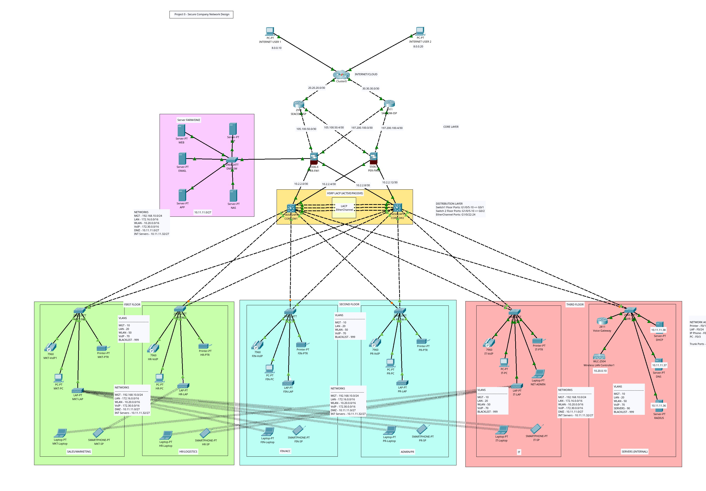

# Project 0 – Secure Company Network Design & Simulation

---

## Overview
This project presents the **network design and simulation** of a secure enterprise network for **Cloud Compute Ltd**, a cloud solutions provider relocating to a new three-storey office building. The design focuses on **redundancy, scalability, and security**, ensuring continuous operations and reliable access to cloud-based services.

[Blogpost & Screenshots](https://www.blackbeardcyber.com/projects/network-project-0-secure-network-design) 

---

## Objectives

- Design a secure, high-availability network architecture.
- Simulate core networking and security components using **Cisco Packet Tracer**.
- Ensure redundancy at every layer – ISP, firewall, and switching.
- Segment internal traffic using VLANs and implement **inter-VLAN routing**.
- Secure external services within a **DMZ** using **Cisco ASA firewalls**.
- Provide robust **wireless** and **VoIP** infrastructure.
- Implement basic security measures (STP PortFast, BPDU Guard, Port Security, ACLs, DHCP Snooping) at the network access layer.

---

## Key Features
- **Dual ISPs (SEACOM & SAFCOM)** for internet redundancy.
- **Two Cisco ASA 5500-X firewalls** configured with inside, outside, and DMZ zones.
- **OSPF routing** across firewalls and distribution switches for dynamic path selection.
- **HSRP configuration** for gateway redundancy and failover.
- **Layer-3 distribution switches** for inter-VLAN communication.
- **DHCP, DNS, AD, and RADIUS** hosted internally; **Web, App, FTP, NAS, and Email** servers in DMZ.
- **Wireless LAN Controllers (WLC)** with centralised access point management.
- **VoIP gateway and IP phones** with 4xx extension scheme.
- **Standard ACLs** for SSH access limited to management network.
- **STP PortFast & BPDU Guard** for fast and loop-free convergence.
- **Port Security** to prevent unauthorised devices from connecting to the _LAN_ network.
- **DHCP Snooping** to specify and restrict _trusted_ ports connected to legitimate DHCP servers.

---

## Network Addressing Plan
| Network Type | Address Range | Purpose |
|---------------|----------------|----------|
| Management | 192.168.10.0/24 | Administrative access |
| WLAN | 10.20.0.0/16 | Wireless users |
| LAN | 172.16.0.0/16 | Wired devices |
| VoIP | 172.30.0.0/16 | Voice traffic |
| DMZ | 10.11.11.0/27 | Public servers |
| Public IPs | SEACOM: 105.100.50.0/30 SAFCOM: 197.200.100.0/30 | ISP connectivity |

---

## Tools & Technologies
- **Cisco Packet Tracer**
- **Cisco ASA 5500-X** (Simulated using ASA 5506 Firewalls)
- **Catalyst 3850** (simulated using 3650 24Ports) & **2960 switches**
- **Cisco WLC & LAPs**
- **Cisco Voice Gateway**

---

## Future Improvements
- Implement **AAA via TACACS+** for centralised admin authentication.
- Introduce **Syslog and SNMP** for monitoring and alerting.
- Add an additional **WLC**, **DHCP server**, & **VoIP voice gateway** for high availability and redundancy. 
- Simulate failover scenarios for disaster recovery testing.

---

## 🏴 Author

**Marcel Blackbeard**  
*IT & Cybersecurity Professional*  
💼 [LinkedIn](https://linkedin.com/in/marcel-blackbeard) • 🌐 [Cybersec Captain Blackbeard](https://www.blackbeardcyber.com)

---

> “Skill over hype. Depth over noise. Break stuff. Learn fast. Secure everything.”